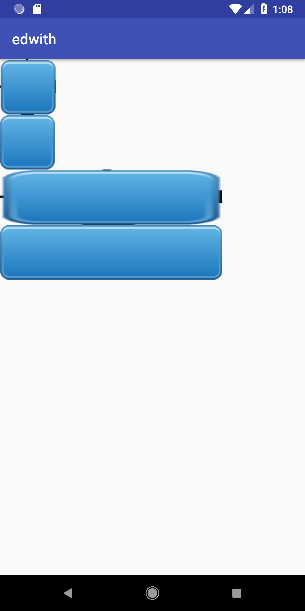

# 비트맵 버튼 만들기

##  1) 나인 패치 이미지

안드로이드에는 이미지 뷰를 사용하는데, 지정한 이미지가 어떤 크기를 가지던 상관 없이,이미지를 넣으면 기본적으로 크기가 조정이 된다. 하지만, 이미지가 늘어져버리므로 깨지고 왜곡되는 경우가 발생하는데, 이런 불편함을 해소하기위해 신기한 **나인패치** 를 제공한다. 

##### 간단하게 나인패치란?

작은 이미지가 확대 되더라도, 외형의 이미지는 깨지지 않고 대형이미지 출력이 가능하게끔 가공된 것

##### 이미지


##### 기본 이미지

모서리가 반투명이고, 깨진다.

##### 나인패치 이미지

png 확장자 앞에 `.9` 로 지정되어있는 것. 

나인패치 이미지는 가장자리 1px 를 구분한다. 이 가장자리 1px 를 깨지는 부분으로 구분한다. 

#### 나인패치 실험해보기!

요구사항

```
이미지를 두종류로 설정할것이다
그냥 이미지와, 나인 패치 이미지를 만들고, 
어떻게 차이가 나는지 알아보자!
```

목차

```
1. 깨지는 버튼 이미지 갖다 넣어보기
2. 확장자를 .9 붙힌 다른이름으로 같은 이미지 추가해보기
```

####  

#### 1. 깨지는 버튼 이미지 갖다 넣어보기

`res/drawable` 에 추가해본다.

#### 2. 확장자 .9를 붙힌 다른이름으로 같은 이미지 추가해보기

`.9`를 붙히면 확장자로 인식함으로, 다른 이미지로 해야한다.

이렇게 비교를 해보면, `.9` 를 가진 이미지는 다른 이미지와 달리 신기한 툴이 보인다.

#### 3. 레이아웃 만들어보기

기존 이미지는 `noninepatch` 로, 나인패치이미지는 `yesninepatch` 이미지로 구분을 지었다. 

```xml
<?xml version="1.0" encoding="utf-8"?>
<LinearLayout xmlns:android="http://schemas.android.com/apk/res/android"
    android:orientation="vertical"
    android:layout_width="match_parent"
    android:layout_height="match_parent"
   >
    <ImageView
        android:layout_width="wrap_content"
        android:layout_height="wrap_content"
        android:src="@drawable/noninepatch"
        />
    <ImageView
        android:layout_width="wrap_content"
        android:layout_height="wrap_content"
        android:src="@drawable/yesninepatch"
        />
    <ImageView
        android:layout_width="300dp"
        android:layout_height="wrap_content"
        android:scaleType="fitXY"
        android:src="@drawable/noninepatch" />

    <ImageView
        android:layout_width="300dp"
        android:layout_height="wrap_content"
        android:scaleType="fitXY"
        android:src="@drawable/yesninepatch" />
</LinearLayout>
```

 진짜 신기하다. 기존이미지는 깨지는데, 나인패치 이미지는 깨지지 않는다. 

1. 깨지는 현상이 되는데, 두번째꺼는 깨지는 현상이 생기지 않는다. 
2. 나인 패치는 까만색이 아닌 부분은, 늘어나면 안됩니다 라고 설명을 해준다. 이런 정보를 설정해주기 때문에 , 가장자리 부분은 안늘어나기 때문에 깔끔해 진다.

#### 결과



## 2) 비트맵 버튼 만들기

안드로이드에는 다양한 위젯이 있는데, 

버튼 모양을 조금 커스텀 하고 싶은 경우가 있는데, 버튼에서 사용할 속성이 없다면 

버튼을 상속해서 원하는 기능을 추가할 수 있습니다.

버튼의 배경에 이미지를 넣어주고, 이미지 버튼이 터치된 상태에 따라 바뀌게 만들 수 있습니다.


### 비트맵 버튼 

이번엔 비트맵 버튼을 만듭니다.

버튼을 상속해서, 동시에 필요한 것을 수정하고 기능을 바꿔보겠습니다. 

#### 뷰를 상속할때 이해해야 할 점

- onDraw
  - 버튼을 보여주기 전에, 버튼 내부에 그리는 과정이 있습니다.
  - 그래픽을 그리는 과정에, 무언가 추가하고싶으면 버튼을 직접 그리는 커스텀을 할 수 있습니다.
- onMeasure
  - 버튼이 할당되는 영역을 확인할 수 있습니다.

뷰 클래스를 상속했을때, 가장 주의깊게 관심갖고 봐야합니다

위에 그려주고 리프레시 될때

- onDraw()
- invalidate() 를 거칩니다.

### 버튼 만들기 

*요구사항*

```
버튼을 상속해서 새로운 버튼을 커스텀 해본다.
배경 이미지를 설정해서, 버튼이 보일때 이미지도 같이 보이게 합니다.
클릭을 했을때 , 다른 배경 이미지를 보이게 합니다.
```

목차

```
1. 버튼을 상속한 새로운 클래스 정의
2. xml 레이아웃 추가
```

#### 1.1 버튼을 상속한 새로운 클래스 정의 

SuperClass 에 `android.support.v7.widget.AppCompatButton` 을 상속한다

#####*Q. 왜 Button 상속안하고 안하고 이걸 상속하는지?*

 그냥 버튼을 상속하면, 최신` OS`나, 지원하는 `OS` 가 한정되어있는데, `AppCompatButton` 을 사용하면 최신 버전을 지원한다고 한다.


#### 1.2 생성자 생성

위 SuperClass 를 상속한 Class 를 생성하면 *디폴트 생성자가 없습니다*  라는 문구가 뜨면서 빨간줄이 뜨게 된다.

```java
// 빨간줄이 뜹니다.
package com.soomti.edwith;
import android.support.v7.widget.AppCompatButton;
public class BitmapButton extends AppCompatButton {
}

```

두번째 generator 까지 추가를 해보자.

안드로이드는 버튼을

- 레이아웃
- 소스파일 

두가지로 만들 수 있다. 

첫번째 생성자는 "소스파일"로 만들었을 때 사용하고,

두번째 생성자는 "레이아웃"으로 만들었을 때 사용한다. (..세번째는?)

##### 생성자를 추가한 비트맵 버튼 커스텀

```java
package com.soomti.edwith;

import android.content.Context;
import android.support.v7.widget.AppCompatButton;
import android.util.AttributeSet;

public class BitmapButton extends AppCompatButton {
    public BitmapButton(Context context) {
        super(context);
    }

    // 태그를 가져와 객체로 인플레이션 할때 사용한다..?
    public BitmapButton(Context context, AttributeSet attrs) {
        super(context, attrs);
    }
}

```

#### 1.3 init() 만들어보기

버튼 초기 설정을 만든다.

##### setBackgroundResource()

: `R.drawable`을 통해 배경 이미지를 설정하는 함수

##### setTextSize()

: 글자 크기를 지정하는 함수. 

 px 단위로 지정하기 때문에, dp 로 설정하고 싶다면 dimens.xml 을 만들어 dp 단위로 설정할 수 있다.

##### dimen tag

: xml 에 dimen 태그는 숫자를 말한다. 

```xml
<dimen name="text_size">16dp</dimen>
```

이것을 통해, setTextSize 를 고정할 수 있다.

```java
private void init(Context context){
    setBackgroundResource(R.drawable.heart);
    setTextSize(100);
    setTextSize(R.dimen.textSize);
}
```

##### getResource

: R 밑에 있는 파일을 리턴한다. 

##### getDimension

: dimens.xml 에 내용을 가져온다. 

```java
float textsize = getResources().getDimension(R.dimen.textSize);
```


#### 1.4 버튼 터치 이벤트 작성하기.

event 를 받아와 눌렸을때와 안눌렸을때를 구분해주자.

##### invalidate()

: 버튼을 다시 그리는 함수! 

```java
@Override
public boolean onTouchEvent(MotionEvent event) {
    int buttonstatus = event.getAction();

    if(buttonstatus == MotionEvent.ACTION_DOWN) {
       setBackgroundResource(R.drawable.heart2);
    }else if (buttonstatus == MotionEvent.ACTION_UP){
       setBackgroundResource(R.drawable.heart);
    }
    // 이미지를 다시 그려주어야 하기 때문에 invalidate() 를 호춣해야합니다.
    invalidate();
    return true;
}
```


#### 2. 레이아웃 추가해주기

커스텀한 비트맵 버튼을 레이아웃에 추가해주자.

직접 커스텀한 뷰를 추가해주는거기때문에, 꼭 **패키지를 같이 추가**해주어야한다.

```xml
<?xml version="1.0" encoding="utf-8"?>
<LinearLayout xmlns:android="http://schemas.android.com/apk/res/android"
    android:orientation="vertical"
    xmlns:tools="http://schemas.android.com/tools"
    android:layout_width="match_parent"
    android:layout_height="match_parent"
    tools:context=".CustomBitmapButtonActivity">

    <com.soomti.edwith.BitmapButton
        android:layout_width="wrap_content"
        android:layout_height="wrap_content" />

</LinearLayout>
```


## ERROR

 invalidate() 를 호출 안하면 갱신이 되어야 하지 않는데, 되는 상황이 발생한다. 왜그런지 알아볼것 