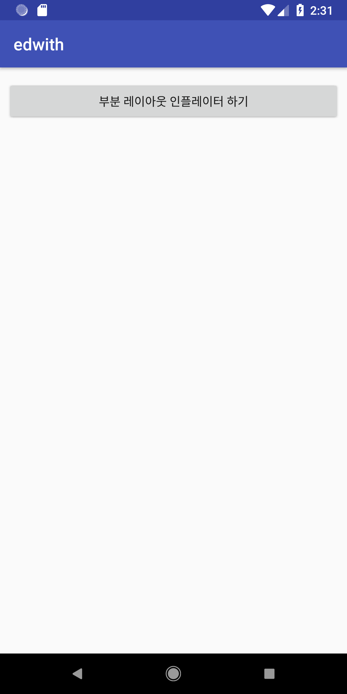
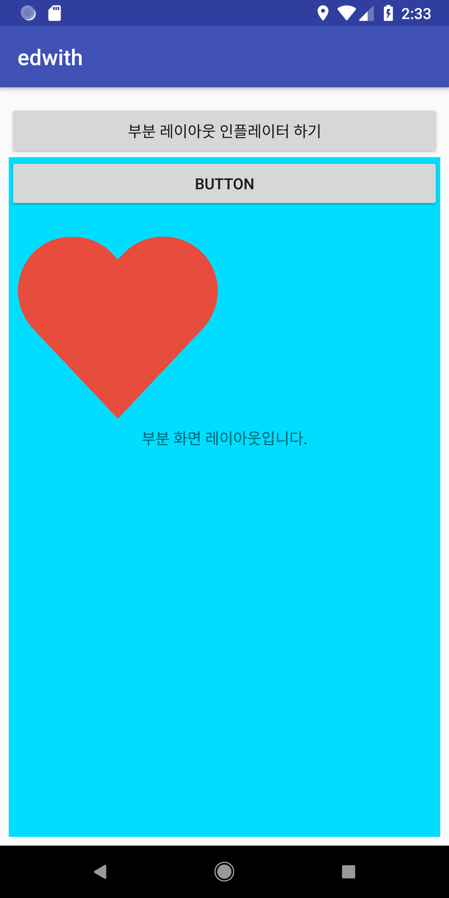

# 5. 인플레이션 이해하기

##1. 개념

인플레이션은 xml 파일을 메모리에 넣어 객체로 변해주는과정을 말한다.

`JAVA` 코드에서는 객체화할때 

```java
Button button = new Button()
```

와같이 `new ` 연산자를 써서 heap 메모리에 객체를 생성하는데, `XML` 은 그런 기능이없다.

따라서 `xml ` 파일에 있는 위젯,레이아웃을 객체화 하는 과정이 필요한데 

이때 도와주는게 **인플레이션** 이다.

#### 화면

화면은 **사용자에게 보여지는 공간** 이다. 

지금까지 **뷰**를 여러 만들었는데, 이 xml 을 가져와 

따라서, 프로젝트를 생성하면 *activity_main.xml* 과 *MainActivity* 가 만들어진다. 

이렇게 만들어진 레이아웃 안에 있는 객체들이 어떤 속성을 가지는지 메모리에 들어있어야지 *findViewById(R.id.button)*

으로 만들 수 있는것이다. 

xml 을 통해 보이는 공간이 어떤 형태로 보이는지 알 수 있다. 

하지만 실제로 눈에 보이지 않고, 뒤에서 어플리케이션을 동작하게 하는 부분이 필요하다. 

```
1. 레이아웃과 인플레이션 이해하기
2. 화면 구성과 화면간 전환
3. 인텐트 살펴보기
4. 액티비티를 위한 플래그와 부가 데이터
5. 액티비티의 수명주기
6. 서비스
7. 브로드캐스트 수신자
8. 위험권한 부여하기
9. 리소스와 매니페스트
```

이런 부분이 있는데, 오늘은 **레이아웃과 인플레이션** 을 알아본다. 

### 1. 레이아웃과 인플레이션 이해하기 

안드로이드는화면을 액티비티라고한다.

 표준 자바와 다르게 

보이는 화면은 보통 `XML` 로, 보이지 않고 동작하는 부분은 `.java` 파일로 두개로 나눠 작성한다.

따라서, 이 파일들을 연결하는 연결고리 역할이필요한데, 

`setContentView()`  메서드를 통해 레이아웃 파일을 객체화 시켜줌으로써, 

```java
setContentView(R.layout.actiivty_main)
```

메서드를 통해 두 파일이 연결되어 하나의 화면을 구성하게 된다. 


#### 인플레이션이란?

xml 레이아웃이 있다고 가정해보자.

```xml
<?xml version="1.0" encoding="utf-8"?>
<android.support.constraint.ConstraintLayout xmlns:android="http://schemas.android.com/apk/res/android"
    xmlns:app="http://schemas.android.com/apk/res-auto"
    xmlns:tools="http://schemas.android.com/tools"
    android:layout_width="match_parent"
    android:layout_height="match_parent"
    tools:context=".inflateActivity">

    <Button
        android:id="@+id/button11"
        android:layout_height="wrap_content"
        android:layout_marginEnd="8dp"
        android:layout_marginStart="8dp"
        android:layout_marginTop="4dp"
        android:text="부분 레이아웃 인플레이터 하기"
        app:layout_constraintEnd_toEndOf="parent"
        app:layout_constraintHorizontal_bias="0.0"
        app:layout_constraintStart_toStartOf="parent"
        app:layout_constraintTop_toTopOf="parent" />
</android.support.constraint.ConstraintLayout>
```

위에 있는` xml` 레이아웃에는 버튼이 존재하지만, 실제로 존재하는 "버튼" 은 아니다. 

`java` 에서는  `new button` 으로 객체화하지만. 

`xml` 에서는 그런 기능이 없으므로 시스템이 해주는데 , 그 시스템 이름이 `레이아웃 인플레이터` 이다.

####  레이아웃 인플레이터 

xml 파일에 있는 위젯을 메모리에 올려주는 시스템

그 시스템을 통해 객체화 하는 것을 `레이아웃 인플레이션` 이라고 한다.

이  `레이아웃 인플레이션` 을 통해 xml안에 있는 뷰를 갖다 쓸 수 있는것이다. 

##### error code - null point Exception

```java
package com.soomti.edwith;

import android.support.v7.app.AppCompatActivity;
import android.os.Bundle;
import android.widget.Button;

public class inflateActivity extends AppCompatActivity {
    @Override
    protected void onCreate(Bundle savedInstanceState) {
        super.onCreate(savedInstanceState);
        // error! 아직 xml 에 있는 버튼을 불러오지도 않음! 
        Button button = (Button) findViewById(R.id.button);
        setContentView(R.layout.activity_inflate);
    }
}
```


####  레이아웃 인플레이션 이해하기

액티비티서는 `setContentView()` 를 통해서 `xml` 에 있는 내용을 메모리에 객체화 해준다.

하지만, `setContentView()` 는 전체 레이아웃 파일만 잡아줄 뿐, 부분 레이아웃은 잡아주지 않는다. 

##### 만약 부분레이아웃에 다른 xml 파일에 있는 레이아웃을 붙히는 경우?

이럴 경우에는, `LayoutInflater Service` 를 통해 인플레이션을 실행해준다.

말이 어렵다. 실습해보기로 알아보자 


## 2. 실습해보기 

#### 요구사항

```
전체 레이아웃에, 부분 레이아웃을 만든다. 
그 부분 레이아웃을 인플레이팅을 한다. 
```


> 프로젝트를 만든 이후에 부터 설명을 한다. 

```java
package com.soomti.edwith;

import android.support.v7.app.AppCompatActivity;
import android.os.Bundle;
import android.view.View;
import android.widget.Button;

public class inflateActivity extends AppCompatActivity {
    Button button;
    @Override
    protected void onCreate(Bundle savedInstanceState) {
        super.onCreate(savedInstanceState);


        setContentView(R.layout.activity_inflate);

        button = (Button)findViewById(R.id.button);

        button.setOnClickListener(new View.OnClickListener() {
            @Override
            public void onClick(View v) {
                // 클릭을 하면 부분 레이아웃을 인플레이팅 시켜줄 것이다.
            }
        });

    }
}
```


> 부분 레이아웃을 만들어 부분 화면 만들기 

이런 부분 레이아웃은  **setContentView()** 를 사용할 수 없기 때문에, **LayoutInflator**라는 시스템 서비스를 사용한다

##### 부분 레이아웃

레이아웃안에 레이아웃안에 구성된 뷰인데 헷갈린다면 밑에 실습을 통해 알아보자! 

##### 시스템 서비스

안드로이드 단말기가 실행됏을때 보이지 않는 부분에 시스템이 미리 실행시켜놓은 부분이라고 한다. 


이제 부분 레이아웃을 추가해보자.


## 3. 부분 레이아웃 추가해보기 

##### 1. activity_main.xml  에 레이아웃 추가 하기 

FrameLayout  을 추가해준다. 

```xml
<?xml version="1.0" encoding="utf-8"?>
<android.support.constraint.ConstraintLayout xmlns:android="http://schemas.android.com/apk/res/android"
    xmlns:app="http://schemas.android.com/apk/res-auto"
    xmlns:tools="http://schemas.android.com/tools"
    android:layout_width="match_parent"
    android:layout_height="match_parent"
    tools:context=".inflateActivity"
    tools:layout_editor_absoluteY="81dp">

    <Button
        android:id="@+id/button"
        android:layout_height="wrap_content"
        android:layout_marginEnd="8dp"
        android:layout_marginStart="8dp"
        android:layout_marginTop="8dp"
        android:text="부분 레이아웃 인플레이터 하기"
        app:layout_constraintEnd_toEndOf="parent"
        app:layout_constraintStart_toStartOf="parent"
        app:layout_constraintTop_toTopOf="parent" />

    <FrameLayout
        android:layout_width="368dp"
        android:layout_height="439dp"
        android:layout_marginEnd="8dp"
        android:layout_marginStart="8dp"
        app:layout_constraintEnd_toEndOf="parent"
        app:layout_constraintStart_toStartOf="parent"
        tools:layout_editor_absoluteY="64dp">

    </FrameLayout>

</android.support.constraint.ConstraintLayout>
```

이제, FrameLayout 에 들어갈 subLayout 파일을 만들어보자. 

##### res/layout/sub1.xml

구분해주기 위해 배경도 하고, 아무거나 막 넣었다.

```xml
<?xml version="1.0" encoding="utf-8"?>
<LinearLayout xmlns:android="http://schemas.android.com/apk/res/android"
    xmlns:app="http://schemas.android.com/apk/res-auto"
    android:layout_width="match_parent"
    android:layout_height="match_parent"
    android:background="@android:color/holo_blue_bright"
    android:orientation="vertical">

    <Button
        android:id="@+id/button11"
        android:layout_width="match_parent"
        android:layout_height="wrap_content"
        android:text="Button" />

    <ImageView
        android:id="@+id/imageView2"
        android:layout_width="match_parent"
        android:layout_height="wrap_content"
        app:srcCompat="@drawable/heart2" />
</LinearLayout>
```

 자 이제, 이 레이아웃을 `FrameLayout` 에 넣어보자. 

넣기 위해 `FrameLayout` 를 부를 수 있는 `id` 가 필요하다. 


##### activity_main.xml

`FrameLayout`에 `id ` 추가

```xml
<?xml version="1.0" encoding="utf-8"?>
<android.support.constraint.ConstraintLayout xmlns:android="http://schemas.android.com/apk/res/android"
    xmlns:app="http://schemas.android.com/apk/res-auto"
    xmlns:tools="http://schemas.android.com/tools"
    android:layout_width="match_parent"
    android:layout_height="match_parent"
    tools:context=".inflateActivity"
    tools:layout_editor_absoluteY="81dp">

    <Button
        android:id="@+id/button"
        android:layout_height="wrap_content"
        android:layout_marginEnd="8dp"
        android:layout_marginStart="8dp"
        android:layout_marginTop="8dp"
        android:text="부분 레이아웃 인플레이터 하기"
        app:layout_constraintEnd_toEndOf="parent"
        app:layout_constraintStart_toStartOf="parent"
        app:layout_constraintTop_toTopOf="parent" />

    <FrameLayout
        android:id="@+id/container"
        android:layout_width="368dp"
        android:layout_height="439dp"
        android:layout_marginEnd="8dp"
        android:layout_marginStart="8dp"
        app:layout_constraintEnd_toEndOf="parent"
        app:layout_constraintStart_toStartOf="parent"
        tools:layout_editor_absoluteY="64dp">

    </FrameLayout>

</android.support.constraint.ConstraintLayout>
```


##### activityMain

이제, `FrameLayout` 을 `java` 코드에 불러와 인플레이팅 작업을 해줄 것이다. 

```java
frameLayout= (FrameLayout)findViewById(R.id.container);
```

이 프레임 레이아웃이라는 변수는 onCreate 안에 정의하면 온클릭메서드에서 사용하지 못한다. 

따라서 액티비티 클래스 인스턴스로 지정해준다. 

##### 인플레이팅 

메인 레이아웃 버튼을 누르면, `FrameLayout` 에 위에 만들었던 `Sub1.xml` 파일을 붙혀줄 것이다.

이건 이 화면에 주  레이아웃이기 때문에, `setContentView()` 를 사용할 수 없다. 위에 말한 부분 레이아웃이 이런 상황이었다.

이렇기때문에 `LayoutInflater` 를 통해 **인플레이팅** 을 거친다. 

그러기 위해 시스템에서 서비스를 불러와야한다고했는데 이때 호출하는 함수는

##### getSystemService() :return Object

: 시스템 서비스 호출하는 함수

1.  `Object` 를 반환하기 때문에 타입 캐스팅이 필요하다

```java
getSystemService();
```

2. 우리는 `LayoutInflater` 를 사용할 것임으로 `(LayoutInflater)getSystemService();` 와 같이 캐스팅해준다. 
3. getSystemService() 의 매개변수에는, 여러시스템 중 어떤 시스템을 호출할지를 말해줘야한다. 우리는 

```
Context.LAYOUT_INFLATER_SERVICE
```

이 서비스가 필요하기때문에, 매개변수에 넣어준다.

###### 최종

```java
LayoutInflater inflater = (LayoutInflater)getSystemService(Context.LAYOUT_INFLATER_SERVICE);
```


##### public View inflate(@LayoutRes int resource, @Nullable ViewGroup root, boolean attachToRoot)

1. `inflate()`함수를 통해 메모리에 객체를 넣어준다. 이때 3개의 매개변수가 있다

   **@LayoutRes int resource**

   메모리를 객체화 할 리소스를 말한다. 우리는 sub1.xml 을 객체화해줘야하므로, 이걸 넣어준다.

   **@Nullable ViewGroup root**

   객체화 한 리소스를 어느 뷰에 붙힐지를 지정해준다. 우리는 FrameLayout 에 넣어주므로, 해당 아이디 값을 넣어준다.

   **boolean attachToRoot** 

   바로 붙힐건지를 묻는다. 바로 붙힌다면 `true`를 넣어준다. 

실행 코드 

```java
package com.soomti.edwith;

import android.content.Context;
import android.support.v7.app.AppCompatActivity;
import android.os.Bundle;
import android.view.LayoutInflater;
import android.view.View;
import android.widget.Button;
import android.widget.FrameLayout;

public class inflateActivity extends AppCompatActivity {
    Button button;
    FrameLayout frameLayout;
    @Override
    protected void onCreate(Bundle savedInstanceState) {
        super.onCreate(savedInstanceState);


        setContentView(R.layout.activity_inflate);


        frameLayout= (FrameLayout)findViewById(R.id.container) ;

        button = (Button)findViewById(R.id.button);

        button.setOnClickListener(new View.OnClickListener() {
            @Override
            public void onClick(View v) {
                // 클릭을 하면 부분 레이아웃을 인플레이팅 시켜줄 것이다.

                // 서비스를 사용하기 위해 getSystemService 를 통해 서비스 호출
                // 그 중 layout_inflater_service 선택
                LayoutInflater inflater = (LayoutInflater)getSystemService(Context.LAYOUT_INFLATER_SERVICE);

                // xml 파일을 메모리로 객체화해 , frameLayout 에 붙혀준다.
                inflater.inflate(R.layout.sub1,frameLayout,true);
            }
        });
    }
}

```


##### 이미지




