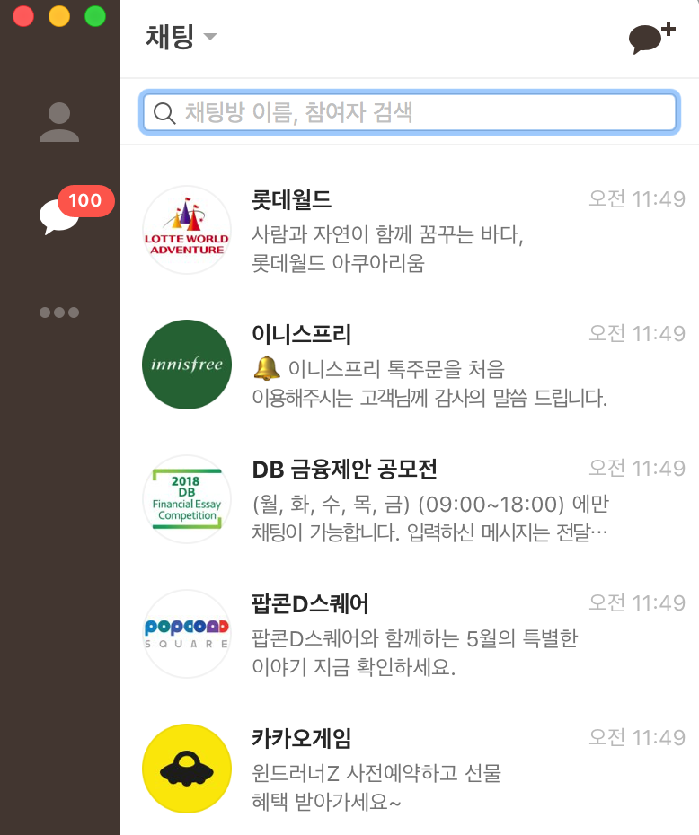

# 6. 리스트뷰 만들기

**들어가기 전에**

```
연락처 앱에서 볼 수 있는 리스트는 어떻게 만들 수 있는 걸까요? 리스트 안에 들어가 있는 각각의 데이터는 같은 모양이 계속 반복되면서 보이는데 이 경우에 어떻게 레이아웃을 만들어야 할까요?리스트뷰에는 여러 개의 데이터를 넣어 보여줄 수 있는데, 좀 더 쉽게 만들 수 있도록 어댑터라는 것을 만들어 사용합니다.
어댑터라는 것을 사용해야 하니까 처음에는 복잡하게 느껴지지만 리스트뷰뿐만 아니라 격자형태로 보여주는 그리드뷰나 콤보박스 모양의 스피너에도 비슷한 방식으로 사용된다는 걸 알게 되면 여러 개의 아이템을 보여주는 경우에는 비슷한 방식으로 사용한다는 걸 알게 될 겁니다.
어댑터라는 것을 사용해야 하니까 처음에는 복잡하게 느껴지지만 리스트뷰뿐만 아니라 격자형태로 보여주는 그리드뷰나 콤보박스 모양의 스피너에도 비슷한 방식으로 사용된다는 걸 알게 되면 여러 개의 아이템을 보여주는 경우에는 비슷한 방식으로 사용한다는 걸 알게 될 겁니다.
리스트뷰를 어떻게 사용하는지 알아봅시다.
```

## 1) 리스트뷰 만들기

### 리스트뷰란?

간단하게 카톡 대화창 목록이라고 생각하자!

카톡 대화창 목록은 




이런식으로 생겼는데 자세히 보면

하나의 대화창이 

1. 프로필 사진
2. 친구 이름 
3. 마지막 내용
4. 보낸 시간

으로 되어 여러번 반복된다.

그럼 이게 하나의 객체가 되는데 이걸 **아이템** 이라고 한다. 

대화창이 많으면 여러 아이템이 반복되는데, 여러 아이템중 하나를 선택하면 그것을 **선택위젯** 이라고 한다.


이 **위젯**과 데이터는 분리가 되어있는데, 데이터를 관리하는게 **어댑터**이다.


따라서 

1. 리스트뷰는 **여러개의 아이템**으로 이루어져 있다.
2. 하나의 아이템은 여러 값이 들어간다. (아이템 == 클래스)
3. 아이템의 데이터는 **어댑터** 에서 관리한다.
4. 따라서 `리스트뷰` 는 껍데기 역할을 한다.  just 여러개가 들어갈 것이라는걸 알려주는 *뷰* 인듯..?
5. 이 *리스트뷰* 에 어댑터를 연결해주고 설정해주면 
6. 액티비티 실행시, 리스트뷰는 어댑터에게 몇개의 데이터가 있냐고 물어보고, **어댑터** 는 데이터를 반환해준다.
7. 리스트뷰가 선택 위젯을 호출하면, 어댑터에서 `getView()` 를 반환해 요청받은 값의 인덱스를 반환해준다. 

##### 어댑터

1. 데이터 관리 
2. 아이템에 대한 뷰 설정 


##### 선택위젯

하나의 값만이 아닌, 여러개의 같은 아이템이 반복되는 것을 선택 위젯이라고 한다.

이런 위젯들은 `어댑터` 라는 패턴을 쓴다. 

##### 선택 위젯의 종류

1. 리스트뷰
2. 프피너
3. 그리드뷰
4. 갤러리 (잘 안씀)


### 리스트 뷰로 보여줄 때 해야하는 일들 

리스트뷰를 만들기 위해 할 일을 먼저 정리해보자. 

일단 리스트뷰는 **어댑터**패턴을 사용한다. 이 패턴은 많이쓰기때문에 익숙해져야한다! 익숙해지자!


#### 리스트뷰

리스트뷰는 어플리케이션을 만들때 가장 많이 사용하는 위젯 중 하나이다. 

반복되는 리스트 중 하나를 **아이템** 이라고 하는데,

보통 아이템은 하나의 값이 들어갈 수 있지만, 여러개의 값이 들어가는게 보통이다 (위의 대화창)

보통, 카톡 대화창처럼 하나의 아이템에 여러개의 값을 가짐으로, 

이 아이템에 대한 **클래스(.class)**를 만들어주고, 또한 아이템을 어떻게 배치할것인지에 대한 **위젯(.xml)**도 잡아준다. 

이 `java/xml`  을 별도로 정의하고, 이 파일들을 부분화면처럼 집어넣을 것이다. 

##### 돌아보기

액티비티 = 전체화면.

부분화면 = 전체 레이아웃 안에 일부 뷰.

일부 뷰에 배치할 수 있는 것을 말한다 

부분화면이면 액티비티는 전체고, 그 일부 뷰를 얘기를 한다. 레이아웃을 잡을 수 있는 뷰를 얘기한다. 이런 부분화면을 만들어 아이템을 만들어 주는 뷰를 사용하겟다.


##### 간단 순서 정리 

1. 아이템을 위한뷰를 만든다.  xml 레이아웃 / java 파일 정의하기 
2. 아이템을 위한 뷰 정의하기
3. 어댑터 정의하기
4. 리스트뷰 정의하기 

##### getView()

여기에서 return 해주는 뷰가 item 에 보인다.

이 데이터를 이용하여 데이터를 설정해주고 리턴해준다.(..?)

### 프로젝트만들기

프로젝트를 만들어보자!

##### 요구사항

```
걸그룹 이름 / 전화번호를 보여주는 리스트 뷰를 만든다!
```

##### 1. 레이아웃 만들기 

리스트뷰를 만들기 위한 샘플 에이아웃을 만들어본다. `RelativeLayout` 여러 위젯을 넣은 후 `LinearLayout` 을 첨부하고, 그 안에 `ListView` 를 넣어보자. 

```xml
<?xml version="1.0" encoding="utf-8"?>
<RelativeLayout xmlns:android="http://schemas.android.com/apk/res/android"
    xmlns:app="http://schemas.android.com/apk/res-auto"
    xmlns:tools="http://schemas.android.com/tools"
    android:layout_width="match_parent"
    android:layout_height="match_parent"
    tools:context=".ListviewActivity">

    <Button
        android:id="@+id/button12"
        android:layout_width="match_parent"
        android:layout_height="wrap_content"
        android:layout_alignParentStart="true"
        android:layout_alignParentTop="true"
        android:text="메인화면 버튼" />

    <LinearLayout
        android:layout_width="match_parent"
        android:layout_height="match_parent"
        android:orientation="horizontal">
        <ListView
            android:id="@+id/listview"
            android:layout_width="match_parent"
            android:layout_height="match_parent"></ListView>
    </LinearLayout>
</RelativeLayout>
```

리스트뷰를 추가하면 `design` 탭에 이상한 디자인이 보이는데, 그건 가상의 디자인이다!

```java
ListView listView = (ListView)findViewById(R.id.listview);
```

보통 리스트뷰 안의 내용을 만들때, 커스터마이징을 한다. 따라서 각각의 아이템을 위한 **별도의 뷰가** 필요하다. 이 별도의 뷰를 만들고, 어댑터에 넣어줄 것이기 때문에 `BaseAdapter` 를 사용한 어탭터 클래스를 만들어줄 것이다. 

```java
class SingerAdapter extends BaseAdapter {
    @Override
    public int getCount() {
        return 0;
    }

    @Override
    public Object getItem(int position) {
        return null;
    }

    @Override
    public long getItemId(int position) {
        return 0;
    }

    @Override
    public View getView(int position, View convertView, ViewGroup parent) {
        return null;
    }
}

```

`BaseAdapter` 를 상속하면 4개의 메서드가 오버라이드 된다.


##### 걸그룹 정보를 받을 클래스 만들기 

아이템 정보를 담을 객체가 필요하다. 이를 위해 클래스를 만들고,

- 생성자
- getter/setter 를 만들어준다.

```java
package com.soomti.edwith;

public class SingerItem{

    private String name;
    private String mobile;

    public SingerItem(String name, String mobile) {
        this.name = name;
        this.mobile = mobile;
    }

    public String getName() {
        return name;
    }

    public String getMobile() {
        return mobile;
    }

    public void setName(String name) {
        this.name = name;
    }

    public void setMobile(String mobile) {
        this.mobile = mobile;
    }
}
```

##### 어댑터 데이터 

어뎁터에서는 데이터 또한 관리합니다.

데이터를 관리하기 위한 `ArrayList` 를 설정합니다. 

```java
ArrayList<String> items = new ArrayList();
```

보통 문자열 하나만 들어가면, `String` 을 쓰면 되지만, 

`걸그룹 정보`를 하지만, 문자열 하나만 담기에는 정보는 여러개 담기때문에 해당 클래스를 만들어준다. 


```java
class SingerAdapter extends BaseAdapter {

    ArrayList<SingerItem> singerlist = new ArrayList<SingerItem>();

    @Override
    public int getCount() {
        return 0;
    }

    @Override
    public Object getItem(int position) {
        return null;
    }

    @Override
    public long getItemId(int position) {
        return 0;
    }

    @Override
    public View getView(int position, View convertView, ViewGroup parent) {
        return null;
    }
}

```


### 리스트뷰 만들기 2

이제 `Adapter` 안에 데이터를 넣을 `ArrayList `를 만들고, `Singer` 객체를 저장하는 `items` 를 만들었습니다. 

사실상 리스트뷰는 껍데기이고

어뎁터 안에서 데이터를 관리하기 때문에  `Singer` 객체를 저장하는 리스트를 만들었습니다.

**LISTVIEW** 가 화면에 보여지게 되는 시점에, 리스트뷰는 어댑터에게 몇개의 아이템이 있는지 묻습니다. 이것을 오버라이딩 된 값에 세팅해줍니다.

```java

class SingerAdapter extends BaseAdapter {

    ArrayList<SingerItem> items = new ArrayList<SingerItem>();

    // 리스트뷰 또는 선택 위젯이 호출하는 메서드들
    @Override
    public int getCount() {
        // 아이템의 갯수를 반환한다
        return items.size();
    }

    @Override
    public Object getItem(int position) {
        // 해당
        return items.get(position);
    }

    @Override
    public long getItemId(int position) {
        // 아이템의 id 값을 보내라.
        // 가수 아이템엔 id 값이 없으므로 보내지 않음
        return position;
    }

    @Override
    public View getView(int position, View convertView, ViewGroup parent) {
        return null;
    }
}
```

##### 아이템으로 사용할 레이아웃 만들기

`res/layout/singer_item.xml`

전체 화면 처럼 보이지만, 실제로는 아이템으로 보일 레이아웃을 만들어본다.

디자인 자체는 전체 화면으로 보인다. 실제로는 아이템을 위한 레이아웃을 보인다.

왼쪽엔 이미지, 오른쪽에는 전화번호 , 이름을 넣는다.

```xml
<?xml version="1.0" encoding="utf-8"?>
<LinearLayout xmlns:android="http://schemas.android.com/apk/res/android"
    android:orientation="horizontal" android:layout_width="match_parent"
    android:layout_height="match_parent">

    <ImageView
        android:layout_width="80dp"
        android:layout_height="80dp"
        android:src="@drawable/heart"
        />

    <LinearLayout
        android:layout_width="wrap_content"
        android:layout_height="wrap_content"
        android:layout_marginLeft="10dp"
        android:orientation="vertical"
        >
        <TextView
            android:id="@+id/singername"
            android:layout_width="wrap_content"
            android:layout_height="wrap_content"
            android:textColor="@color/colorPrimary"
            android:text="이름"
            />
        <TextView
            android:id="@+id/singerphone"
            android:layout_width="wrap_content"
            android:layout_height="wrap_content"
            android:layout_marginTop="20dp"
            android:layout_marginLeft="5dp"
            android:text="번호"
            />
    </LinearLayout>
</LinearLayout>
```

리니어 레이아웃을 매칭하여, 객체화 해줄 클래스를 만들어준다.

##### SingleItemView.class

##### init() : 레이아웃을 인플레이션 하는 과정을 걸친다. 

```java
package com.soomti.edwith;

import android.content.Context;
import android.support.annotation.Nullable;
import android.util.AttributeSet;
import android.view.LayoutInflater;
import android.widget.LinearLayout;
import android.widget.TextView;

public class SingleItemView extends LinearLayout {
    TextView singername;
    TextView singerphone;
    public SingleItemView(Context context) {
        super(context);
        init(context);
    }

    public SingleItemView(Context context, @Nullable AttributeSet attrs) {
        super(context, attrs);
        init(context);
    }
    public void init(Context context){
        LayoutInflater inflater = (LayoutInflater)context.getSystemService(Context.LAYOUT_INFLATER_SERVICE);
        inflater.inflate(R.layout.singeritem,this,true);
        singername = (TextView)findViewById(R.id.singername);
        singerphone = (TextView)findViewById(R.id.singerphone);

    }
    public void setName(String name){
        singername.setText(name);
    }
    public void setPhone(String phone){
        singerphone.setText(phone);
    }
}
```

이제 Adapter 에 getView 에 넣어보자. 

```java
        @Override
        public View getView(int position, View convertView, ViewGroup parent) {
            // 넘겨줄 뷰를 반환한다
            SingleItemView view = new SingleItemView(getApplicationContext());
            return view;
        }
```

이제 어뎁터에 넣어줄 data를 추가해주는 메서드를 만든다. 

```java
public void addItem(SingerItem item){
    items.add(item);
}
```

데이터를 넣어준다.

```java
package com.soomti.edwith;

import android.content.Context;
import android.support.v7.app.AppCompatActivity;
import android.os.Bundle;
import android.view.View;
import android.view.ViewGroup;
import android.widget.BaseAdapter;
import android.widget.LinearLayout;
import android.widget.ListView;

import java.util.ArrayList;

public class ListviewActivity extends AppCompatActivity {

    @Override
    protected void onCreate(Bundle savedInstanceState) {
        super.onCreate(savedInstanceState);
        setContentView(R.layout.activity_listview);


        ListView listView = (ListView)findViewById(R.id.listview);
        SingerAdapter adapter = new SingerAdapter();
        adapter.addItem( new SingerItem("수지","010-1234-1234"));
        adapter.addItem( new SingerItem("수지2","010-5678-1234"));
        adapter.addItem( new SingerItem("수지3","010-1234-1234"));
        adapter.addItem( new SingerItem("수지4","010-5678-1234"));
        adapter.addItem( new SingerItem("수지5","010-1234-1234"));
        listView.setAdapter(adapter);

    }
}
```


### 이미지 추가해보자

##### 1. singleitem.xml imageview 에 id 부여해주기

원래 아이디가 없었지만, 데이터를 추가해 줌으로 바인딩이 필요해졌다. id 를 추가해주자.

```xml
<ImageView
  android:id="@+id/image"
  android:layout_width="80dp"
  android:layout_height="80dp"
/>
```

##### 2. singleitemview.java 에 image에 대한 내용 추가해주기

아이템 뷰를 인플레이션해줘서, 데이터를 설정해주는 파일이다. 

singleitem xml 에 대응되는 파일이다. 여기에 imageView 데이터를 추가해주자

##### init()

```java
public void init(Context context){
        LayoutInflater inflater = (LayoutInflater)context.getSystemService(Context.LAYOUT_INFLATER_SERVICE);
        inflater.inflate(R.layout.singeritem,this,true);
        singername = (TextView)findViewById(R.id.singername);
        singerphone = (TextView)findViewById(R.id.singerphone);
        // 이미지뷰 인플레이팅 
        image = (ImageView)findViewById(R.id.image);
}
```

이미지를 설정하는 setViewImage 함수도 추가해주자

##### setViewImage()

```java
public void setViewImage(int resID){
    image.setImageResource(resID);
}
```

##### singleitem.java

아이템 객체를 다루는데 image 를 추가해주자

``` java
package com.soomti.edwith;

public class SingerItem {

    private String name;
    private String mobile;
    private int resID;


    public SingerItem(String name, String mobile,int resID) {
        this.name = name;
        this.mobile = mobile;
        this.resID = resID;
    }

    public String getName() {
        return name;
    }

    public String getMobile() {
        return mobile;
    }

    public void setName(String name) {
        this.name = name;
    }

    public void setMobile(String mobile) {
        this.mobile = mobile;
    }

    public int getResID() {
        return resID;
    }

    public void setResID(int resID) {
        this.resID = resID;
    }
    
}
```

##### adapter > getview() 세팅

어댑터는 데이터를 관리해주고, 리스트뷰를 연결해줄 수 있는 클래스이다.

추가할 이미지 데이터가 생겼으니 추가해주자

```java
   @Override
        public View getView(int position, View convertView, ViewGroup parent) {
            // 넘겨줄 뷰를 반환한다
            SingleItemView view = new SingleItemView(getApplicationContext());
            SingerItem item = items.get(position);
            view.setViewName(item.getName());
            view.setViewMobile(item.getMobile());
            view.setViewImage(item.getResID());
            return view;
        }
```

##### 실제 데이터를 추가해준다

```java
SingerAdapter adapter = new SingerAdapter();
adapter.addItem( new SingerItem("aaa","010-1234-1234",R.drawable.heart));
adapter.addItem( new SingerItem("bbb","010-5678-1234",R.drawable.heart2));
adapter.addItem( new SingerItem("ccc","010-1234-1234",R.drawable.ic_launcher_background));
adapter.addItem( new SingerItem("ddd","010-5678-1234",R.drawable.soomti2));
adapter.addItem( new SingerItem("eee","010-1234-1234",R.drawable.pooh));
```


한번 정리하니까 왠지 이해가간다! 


### 아이템이 선택해주기 

##### 요구사항

```
하나의 아이템을 선택했을때 토스트 메세지 띄워보기
```

리스트뷰는 여러 아이템을 화면에 보여주는 역할을 한다 .

따라서 이벤트 처리도 `ListView` 에서 작성해야한다. `setOnItemClickListener` 을 통해 이벤트를 받는다.

```java
listView.setOnItemClickListener(new AdapterView.OnItemClickListener() {
    @Override
    public void onItemClick(AdapterView<?> parent, View view, int position, long id) {}
});
```

사용자가 아이템 클릭 시, 아이템에대한 `position` 이 넘어온다.

이 position 을 통해 어댑터에 있는 객체를 꺼내야한다.

```java
SingerItem item = adapter.getItem(position);
```

이렇게 `adapte` 를 사용하려면 객체 생명주기 때문에 액티비티 인스턴스로 변경해야한다.

```java
public class ListviewActivity extends AppCompatActivity {
    SingerAdapter adapter; // 여기 액티비티 인스턴스로 변경해준다
```


##### 이제 클릭 메서드에 Toast.makeText를 띄워줘보자!

```java
listView.setOnItemClickListener(new AdapterView.OnItemClickListener() {
    @Override
    public void onItemClick(AdapterView<?> parent, View view, int position, long id) {
        SingerItem item = adapter.getItem(position);                  Toast.makeText(getApplicationContext(),item.getName(),Toast.LENGTH_LONG).show();
        }
});
```


### 아이템 추가해보기

```
editText를 두개 만들어 버튼을 클릭하면 아이템을 추가해보자.
```

##### activity_main.xml

```xml
    <LinearLayout
        android:layout_width="match_parent"
        android:layout_height="wrap_content">
        <EditText
        android:id="@+id/editname"
        android:layout_width="0dp"
        android:layout_height="wrap_content"
        android:layout_weight="1"
        />
        <EditText
            android:id="@+id/editphone"
            android:layout_width="0dp"
            android:layout_height="wrap_content"
            android:layout_weight="1"
            />
        <Button
            android:id="@+id/button12"
            android:layout_width="0dp"
            android:layout_height="wrap_content"
            android:layout_alignParentStart="true"
            android:layout_alignParentTop="true"
            android:layout_weight="1"
            android:text="메인화면 버튼" />
    </LinearLayout>

```

이제 java 파일에 editText 를 추가한다.

```java
additem.setOnClickListener(new View.OnClickListener() {
  @Override
  public void onClick(View v) {
    SingerItem item = new SingerItem(editTextname.getText().toString(),editTextphone.getText().toString(),R.drawable.soomti2);
    adapter.addItem(item);
    adapter.notifyDataSetChanged();
    }
});
```

끝!


##### 유의사항

데이터가 많아질경우, `getView()` 시에 읽을 데이터가 많으면 메모리가 부족하다.

따라서 `view` 를 재사용 할 수 있도록 `convertView` 를 `null` 일 경우에만 새로 할당하고,

아닌 경우 `view`를 재사용한다. 이러면 데이터가 많아질 경우끊어지는 문제를 줄여준다.


