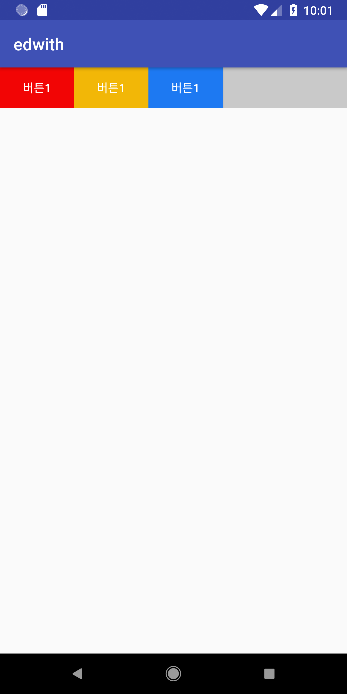
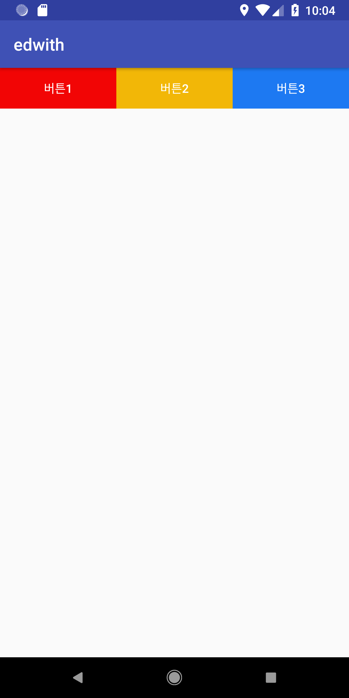
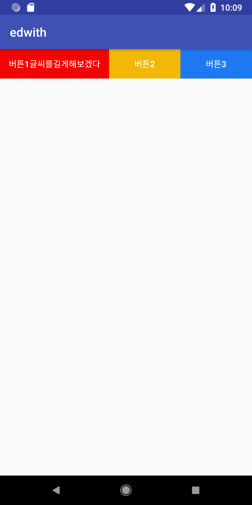

# weight

### 결론

균등하게 나누기 위해 weight 를 사용할거면, 나뉘는 값(width,height)에 0 을 붙혀줘라.


### 시작

`LinearLayout` 에서 사용하는 속성입니다.

`weight` 은 `css` 로 치자면 `Margin` 과 동일하다. 

##### 한마디로 남아있는 부분의 값을 나눈다!


##### horizontal일 경우에는  

width 값에 남아있는 부분을 나눠줍니다.


##### vertical 일 경우에는

height 값에 남아있는 부분을 나눠줍니다.


## 예시


**horizontal**일 경우, 자식 속성을 wrap 으로 감쌌을 때를 보겠습니다.

```xml
<?xml version="1.0" encoding="utf-8"?>
<LinearLayout xmlns:android="http://schemas.android.com/apk/res/android"
    android:orientation="horizontal"
    android:layout_width="match_parent"
    android:layout_height="wrap_content"
    android:background="#c9c9c9"
    >

    <Button
        android:id="@+id/button1"
        android:layout_width="wrap_content"
        android:layout_height="wrap_content"
        android:background="#F20505"
        android:text="버튼1"
        android:textColor="#fff"
     />

    <Button
        android:id="@+id/button2"
        android:layout_width="wrap_content"
        android:layout_height="wrap_content"
        android:background="#F2B707"
        android:text="버튼1"
        android:textColor="#fff"

        />
    <Button
        android:id="@+id/button3"
        android:layout_width="wrap_content"
        android:layout_height="wrap_content"
        android:background="#1D79F2"
        android:text="버튼1"
        android:textColor="#fff"
        />
</LinearLayout>
```

이 경우에 이미지는, 밑에 처럼 나오게됩니다. 회색 공간이 여유 공간이죠. 




이때 각각의 버튼에  `android:layout_weight="1"`을 주게 되면





알아서 꽉 차게 됩니다! 

##### 같은 공간을 나눠 줄때 weight 을 사용하면 되는구나! 

싶지만, 여기서 유의해야하는 점이 있습니다.

weight 의 값은 남는 공간에 대한 비율을 나눠준다는 것 입니다

- 따라서 한 곳에 값에 1을넣어주던, 2를 넣어주던 다 가지고 갑니다. 
- 또한, wrap_content 를 했을 경우 그 크기 외의 공간을 나눠주기 때문에 , 균등하게 나눌 수 없습니다.


버튼 1 글씨를 길게 바꿔서 하는경우



이렇게 균등한 분배가 헛되어집니다. 이럴때를 대비해

weight 를 쓸때는, 나뉘는 비율에 **`0dp`**를 꼭 해주는게 좋습니다.


##### 0dp로 변경

```xml
<?xml version="1.0" encoding="utf-8"?>
<LinearLayout xmlns:android="http://schemas.android.com/apk/res/android"
    android:orientation="horizontal"
    android:layout_width="match_parent"
    android:layout_height="wrap_content"
    android:background="#c9c9c9"
    >

    <Button
        android:id="@+id/button1"
        android:layout_width="0dp"
        android:layout_height="wrap_content"
        android:background="#F20505"
        android:text="버튼1글씨를길게해보겠다"
        android:layout_weight="1"
        android:textColor="#fff" />

    <Button
        android:id="@+id/button2"
        android:layout_width="0dp"
        android:layout_height="wrap_content"
        android:background="#F2B707"
        android:text="버튼2"
        android:layout_weight="1"
        android:textColor="#fff"

        />
    <Button
        android:id="@+id/button3"
        android:layout_width="0dp"
        android:layout_height="wrap_content"
        android:background="#1D79F2"
        android:text="버튼3"
        android:layout_weight="1"
        android:textColor="#fff"

        />
</LinearLayout>
```


##### 결과

