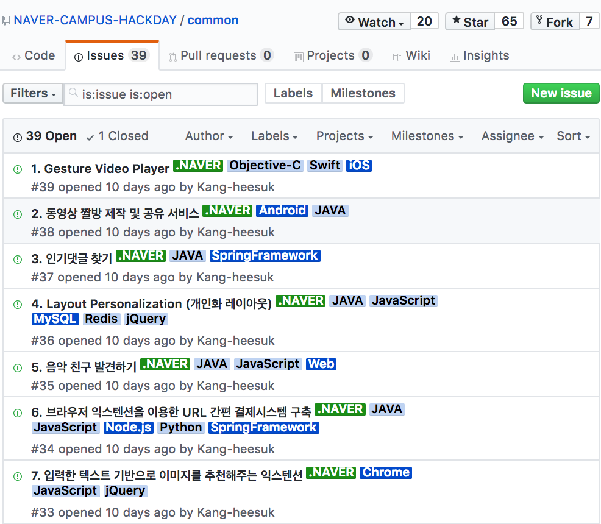

# [JAVA] 0. JAVA 오리엔테이션 - 프로그래밍이란

```
https://www.inflearn.com/course-status-2/ 의 강의 0. 오리엔테이션을 정리한 글입니다.
```

### 프로그래밍이란?

**개발자**는 갑입니다.

**컴퓨터**는 개발자의 일꾼입니다.

**개발자**는 컴퓨터에게 일을 시키기 위해 **프로그래밍 언어** 로 지시합니다.

지시된 명령을 통해 컴퓨터는 **프로그램 ** 을 만들어줍니다.

= 한줄요약 : *컴퓨터*는 *프로그래밍 언어*를 이용해서 *프로그램* 을 만듭니다!


### 사람 vs 컴퓨터 (연산&일꾼이란?)

987 + 100 을 계산해라!

했을때 사람과 컴퓨터는 어떻게 다를까요?


##### 사람


987….더하기...100....은..

뇌를 이용해서 987+100 을 더합니다.


##### 컴퓨터

1. 메모리에 987을 저장한다 (기계기계)
2. 메모리에 100을 저장한다 (기계기계)
3. 프로그래밍 언어로 두 메모리에 담긴 내용을 더하라고 명령한다 (기계기계)
4. cpu 는 계산한다. (cpu = 사람의 뇌 )

처럼 계산을합니다


### 번역기란 (= 컴파일러)


나는 한국인이라 한국어를 쓰고..

중국인은 중국어를쓰듯이..

컴퓨터는..컴퓨터라...0과1을 통해 소통합니다..(아련)


영어를 쓰는 외국인에게 도움을 요청할때   `"도움"` 이라고 하면 못알아먹어서 망합니다.

 `"헲!"`이라 해야 알아듣듯,

따라서 컴퓨터에게 또한  **011001101010** 과 같이 이진법으로 설명해야 알아들을 수 있어요!

우리가 한글을 영어로 번역하듯 **프로그래밍 언어** 를 **이진법**으로 번역해주는 친구가 있습니다.

그거슬 **컴파일러** 라고 부릅니다. 

`JVM`을 통해...하지만 나중에 알아봅시다!


### 자바의 장점

1. 전세계적으로 인기 짱 

   

이거보세여... 네이버에서도 이렇게 자바를 많이 사용합니당...(최근에 레일즈만 파서 신청을 못하겠다는...항헝헎머)

2. 안드로이드 만들 때 자바 사용

   근데 요즘 oracle vs google 싸우기도했고 코틀린이 대세라고해요! 코틀린도 나중에 올려보겠습니다.


```
1강 – JAVA 프로그래밍 이란 (1)
2강 – JAVA 프로그래밍이란? (2)
3강 – 컴퓨터와의 기본적인 소통수단 (1)
4강 – 컴퓨터와의 기본적인 소통수단 (2)
5강 – 배열
6강 – 객체지향 프로그램의 시작
7강 – 객체지향 프로그램의 본질
8강 – 객체지향 프로그램의 기초적인 코딩 방법
9강 – 클래스 실전
10강 – 패키지 및 접근 제한
11강 – static
12강 – 상속 (1)
13강 – 상속 (2)
14강 – 추상클래스 (1)
15강 – 추상클래스 (2)
16강 – 추상클래스 (3)
17강 – 인터페이스 (1)
18강 – 인터페이스 (2)
19강 – 패턴을 통한 객체지향 언어의 이해
20강 – 패턴을 통한 객체지향 언어의 이해 (2)
21강 – 패턴을 통한 객체지향 언어의 이해 (3)
22강 – API (1)
23강 – API (2)
24강 – API (3)
25강 – 예외처리
26강 – JAVA Collections (1)
27강 – JAVA Collections (2)
28강 – JAVA 입출력(I/O) 알아보기
29강 – JAVA 스레드
30강 – JAVA 그래픽
31강 – JAVA 네트워크
```

