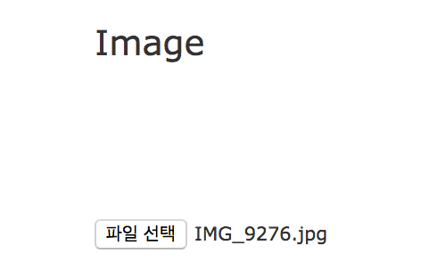
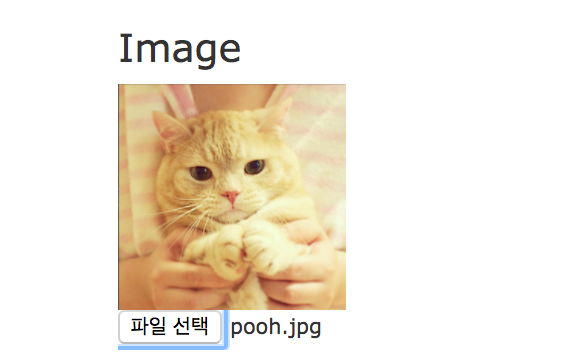

# HTML5에 이미지 preview 띄우기
    
`html5` 파일 이미지를 등록하고 확인버튼을 눌렀을 때, 파일 이름만 나오지 사진이 나오지 않는다 ㅠㅠ 미리보기를 띄워주고 싶을때는 자바스크립트를 사용해서 띄워줄 수 있다

##### html5 
```html
    
    <!-- onchange event 걸어주기  -->
    <input accept=".jpg" onchange="PreviewImage();" type="file" name="user[profile_img]" id="user_profile_img" />
```
##### Javascript
```javascript
    function PreviewImage() {
        // 파일리더 생성 
        var preview = new FileReader();
        preview.onload = function (e) {
            // img id 값 
            document.getElementById("user_image").src = e.target.result;
        };
        // input id 값 
        preview.readAsDataURL(document.getElementById("user_profile_img").files[0]);
    };
```
### Before


### After

