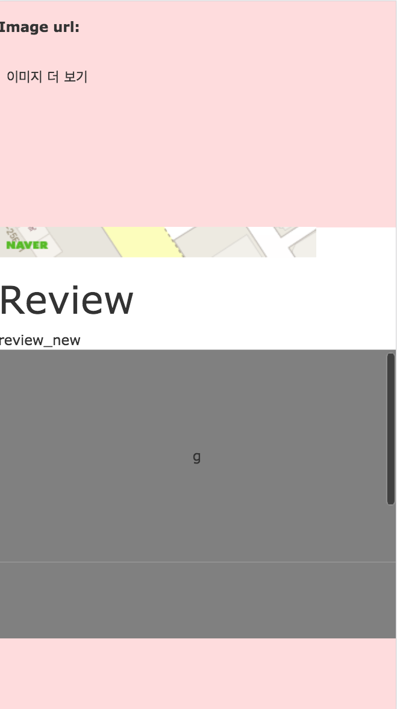

# [Jquery] rails - kaminari gem을 사용한 무한 스크롤 만들기

## Problem 
RoR을 통해 무한 스크롤링을 만드는데, 어떤식으로 값에 접근해야되는지 고민중. plugin이 존재했지만 복잡해보이고 왠지 혼자 할 수 있을 것 같아서 하루종일 해맸다. 결과적으로 더럽게 해결

## Solve 
##### github code
- https://github.com/likesoomti/kaminari-test

## Image
분홍색이 고정되어있는 layout 이고 그 중간에 페이지가 스크롤링 되는 정도 

## Solve

### 1. 무한스크롤 뷰  만들기 
```javascript
 // 무한 스크롤 
  $(".store_info").scroll(function() {
    // store content scrolltop 0 부터 시작한다
    store_scroll_top = $(".store_info").scrollTop();
    // store div value 고정 값 
    store_info_height = $(".store_info").height();  
    // store content overflow height
    store_real_height = $(".store_info")[0].scrollHeight ;
    // 고정값+ 스크롤 끝값 = real_height
    if(store_real_height == store_scroll_top + store_info_height){
      console.log("end!")

      // 스크롤이 끝에 닿을때 가져온다! 
    }
``` 
### 2. [gem] kaminari  설치 
페이지 네비게이션을 통해 편하게 하고싶어 **kaminari gem** 을 사용하였다. kaminari 에 대한 정보는  
- https://github.com/kaminari/kaminari
- https://github.com/likesoomti/STUDY/blob/master/Ruby%20On%20Rails/DOCS/%5BGem%5D%20kaminari.md

를 참고하면 된다 

### 3. ajax 를 통한 스크롤 
위에 만든 페이지 스크롤 jquery에 ajax를 통해 값을 받았다. `next_page`값을 hidden div에 넣어서 다음 페이지를 불러오게 만들었다. 같은 클래스라 쌓이면서 맨 끝 값에 `next_page`가 들어가는 형식이어서, 마지막 *length*를 통해 페이지 url을 바꾸는 식으로 했다. 왜인지 모르겠는데 계속 무한루프 돌고 짜증나서 야매로 했다..
##### ajax
```javascript
   var count = 1    // 무한 스크롤 플래그
   $(".post_container").scroll(function() {
    console.log("hi")
     store_scroll_top = $(".post_container").scrollTop();
     store_info_height = $(".post_container").height();
     store_real_height = $(".post_container")[0].scrollHeight ;
    
     if(store_real_height == store_scroll_top + store_info_height){

       lastpage = "<%= @posts.total_pages %>";       
       len_check = $(".posts_next")
       console.log()

       n_page = len_check[len_check.length-1].innerHTML;

       if(count < lastpage){
         console.log(count);
         $.ajax({
           method: "post",
           url: "/posts/kami?="+n_page,
           data:{
             next_page: n_page
           },
           dataType: "html"   
         })
         .done(function( msg ) {
             $(".post_container").append(msg);
           }); 
       }
       count++;
     }
    }
   );
  ```
##### view 
```html
<div class="post_container">
  <% @posts.each do |p| %>
  <div class="posts">
      <%= p.title %><br>
  </div> 
  <% end %>
  <div class="posts_next"><%= @posts.next_page %></div>
</div>
```
##### ajax 받는 view 
```html
<% @posts.each do |post| %>
<div class="posts">
    <p><%= post.title %></p>
</div>
<% end %>
<div class="posts_next"><%= @posts.next_page %></div>
```
##### controller
```ruby
class PostsController < ApplicationController
  def index
  # @posts = Post.page(params[:page])
     @posts = Post.page(params[:page]).per(10)
  end
  def kami
    @posts = Post.page(params[:page]).per(10)
  end
end
```
무튼 ... 야매로도 되니..해결.. 더 좋은 방법이 생기면 바꾸겠다..