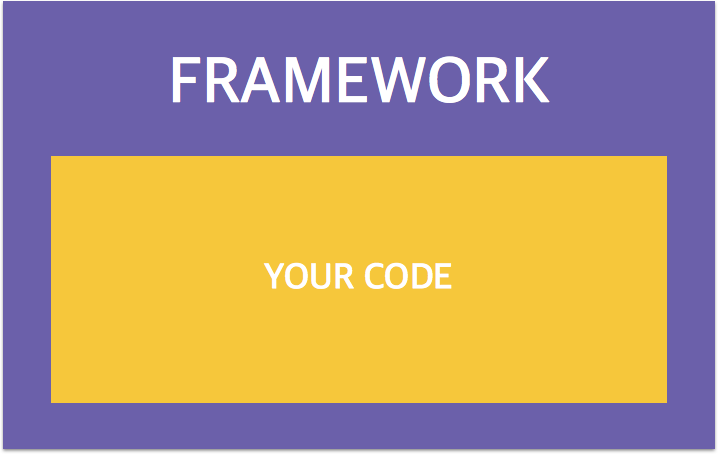
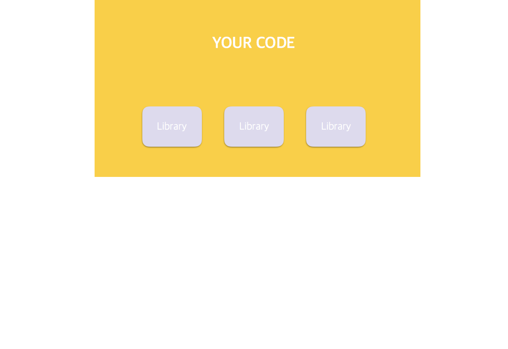

# [NODE] 개발을 빠르고 쉽게 만들어주는 도구들을 알아보자! - 1. 프레임워크, 라이브러리 , 플랫폼에 대해서 

웹사이트를 구축할 경우 밑바닥부터 하나하나 만드는 것은 오래 걸리고, 복잡하며, 유지보수하기 어렵습니다. 이런 불편한 점을 개선시키기 위해 많은 개발자들은 손쉽고 빠른 프로젝트 개발을 위한 여러가지 도구를 만들어 주었는데요. 이러한 도구에 대해 알아봅시다. 

## 프레임워크 , 라이브러리, 플랫폼

프레임워크, 라이브러리, 플랫폼은 개발 공부를 하면서  많이 듣게 되는 단어 중 하나인데요. 비슷한 것 같지만 굉장히 헷갈리는 개념들 중 하나입니다. 차이점이 뭘까요?

### 프레임워크 

프레임워크는 프로젝트의 구조를 잡아주는 역할을 합니다. 필수적으로 필요한 구조를 잡아주기 때문에 프레임워크 만으로도 프로젝트는 돌아가며 이에  필요한 라이브러리를 포함하고 있습니다. 프레임워크로 구조를 잡아주면, 여러 규칙이 존재하기 때문에  프레임워크의 틀에 맞춘 프로젝트의 개발을 해야합니다. 

 
### 라이브러리 

라이브러리는 프로젝트 시 필요한 기능들을 모아둔 도구입니다. 전체적인 프로젝트 구조에서 기능을 제공해 줍니다. 선택적으로 필요한 `부품`입니다. 라이브러리는 필요한 하나의 기능 단위를 말하기 때문에 선택적으로 필요한 부분을 설치해서 사용합니다.

### 프레임워크 vs 라이브러리 

`프레임워크`와 `라이브러리`의 차이를 간단하게 말하면 프레임워크는 `구조`를 잡아주기 때문에 프로젝트가 돌아가지만, 라이브러리는 `도구`이기 때문에 돌아가지 않습니다. 

 건축으로 예를들어볼까요? 

 건물을 지을때, 건축물을 올리기위해 철골을 쌓아놓고 건축을 시작합니다. 이를 `Scaffolding`이라고 하죠. 
 
 `웹사이트` 제작시에도 이런 철골 작업이 필요합니다. 
 
 웹을 프레임워크 없이 밑바닥 부터 구축한다면 시간도 오래걸리고, 보통 협업을 하기 때문에 다른사람들에게 남들에게 내가 만든 프로젝트 구조를 설명해줘야 합니다. 

 이런 불편함을 해결하기 위해 기본적인 구조를 한번에! 잡아주는 역할이 `프레임워크` 입니다.

 
 
 `건축`으로 비교하자면 집에 가장 필요한 기본적인 `방`,`화장실`,`거실`같은 구조만 갖춘 형태로 만들어줍니다.

 `웹프레임워크` 또한 웹사이트가 실행이 될 수 있도록 하는 기본적인 라이브러리들만 가지고 웹사이트를 만들어줍니다. 그럼 라이브러리는 어떤존재들일까요?

 ### 라이브러리

라이브러리는 이런 기본적인 웹사이트를 더 편안하고, 예쁘게 만들어주는 도구라고 생각하면 됩니다. 

기본적인 건축이 끝나서 입주를 할 수있다고 가정해봅시다. 사람이 살 수 있는 상태이지만 가구나 가전용품들이 필요하겠죠? `침대`나 `이불`이 필요하고, 예쁘게 꾸미고 싶다면 `벽지` 또는 `리빙 가구`들로 꾸밀 수 있습니다.

 

라이브러리는 기본적으로 웹사이트가 돌아가게 만든 프레임워크에 `세탁기`,`비데`,`냉장고` 와같은 기능과 같습니다. 라이브러리를 통해 예쁘고, 다양한 기능을 넣어 원하는 사이트를 더욱 빠르게 구축할 수 있습니다. 

### 플랫폼 

소프트웨어에서의 플랫폼의 정의는 `프로젝트가 실행되는 환경`을 말합니다. Node.js 또한 플랫폼입니다. 

건축으로 말하면 내진설계방식..? 이런게 되려나요 ㅎㅎ

##### Node.js의 실행 환경 

- 네트워크 애플리케이션(특히 서버 사이드) 개발에 사용되는 소프트웨어 플랫폼 
- Javascript 언어 사용
-  Non-blocking I/O와 단일 스레드 
- 내장 HTTP 서버 라이브러리를 포함하고 있어 별도의 소프트웨어 없이 동작하는 것이 가능
- 웹 서버의 동작에 있어 더 많은 통제 가능 

자 이제 기본적인 개념을 알았다면, 다음 페이지에서 Node.js에서 사용되는 프레임워크 중 가장 대표적인 Express.js를 알아봅시다~! 

#### 참고 자료
- http://blog.gaerae.com/2016/11/what-is-library-and-framework-and-architecture-and-platform.html
- https://ko.wikipedia.org/wiki/Node.js