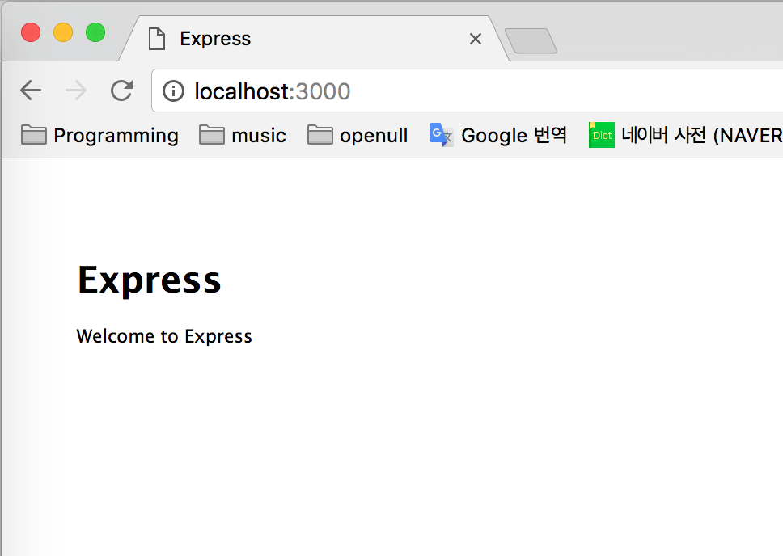

# [NODE] 개발을 빠르고 쉽게 만들어주는 도구들을 알아보자! - 2. Express.js 프레임워크 설치 및 실행

이전장에서 프레임워크, 라이브러리, 플랫폼의 개념을 살펴보았는데요. 대표적인 Node.js의 프레임워크인 Express.js에 대해 알아보겠습니다.

## Express.js

Express.js 는 http와 Connect 컴포넌트를 기반으로 Node.js에서 사용하는 웹 프레임워크 입니다. 가장 많이 사용하는 프레임워크이며, 안정적이기 때문에 웹 규모에 관게 없이 웹 서버를 구축할 수 있습니다.


### 설치
```
$ npm install -g express
```

## express-generator
`express-generator`는 Express 웹 프레임워크의 구조를 만들어주는 Express Application Generator Tool입니다. Express 프레임워크의 구조를 신속하게 작성하기 위해 사용합니다.

### 설치
```
$ npm install -g express-generator
```

위 명령어가 설치가 완료되면, Express 프레임워크 구조를 설정해주는 커맨드 명령어를 실행할 수 있습니다. 

### 명령어 확인하기 
```
$ express -h
```

`express-generator`가 성공적으로 설치되어있다는 것을 확인할 수 있는 명령어 입니다. 아래는 명령어 내용들을 확인할 수 있습니다
##### result 
```
  Usage: express [options] [dir]
  Options:

        --version        output the version number
    -e, --ejs            add ejs engine support
        --pug            add pug engine support
        --hbs            add handlebars engine support
    -H, --hogan          add hogan.js engine support
    -v, --view <engine>  add view <engine> support (dust|ejs|hbs|hjs|jade|pug|twig|vash) (defaults to jade)
    -c, --css <engine>   add stylesheet <engine> support (less|stylus|compass|sass) (defaults to plain css)
        --git            add .gitignore
    -f, --force          force on non-empty directory
    -h, --help           output usage information
```

express -h 로 옵션을 확인해 보니, view 와 css의 부분은 default로 `jade` 와 `css`가 설정이 되어있는 것을 알수있네요. 한번 확인해볼까요 ? 

##### myapp/views/index.jade
##### myapp/public/stylesheets/style.css
의 파일을 확인할 수 있습니다.


## Express-generator로 express framework 생성하기

간단하게 만들어보고 Express-generator 가 만들어준 파일을 분석해 보겠습니다.

#### 1. 설치 
굉장히 간단합니다. `express 프로젝트이름` 형식으로 폴더 구조를 만들어 줍니다
```
$ express myapp
```

##### result
결과 로그를 확인해 봅시다.
```
 $ express myapp

// 1. 
  warning: the default view engine will not be jade in future releases
  warning: use `--view=jade' or `--help' for additional options

// 2. 
   create : myapp
   create : myapp/package.json
   create : myapp/app.js
   create : myapp/public
   create : myapp/routes
   create : myapp/routes/index.js
   create : myapp/routes/users.js
   create : myapp/views
   create : myapp/views/index.jade
   create : myapp/views/layout.jade
   create : myapp/views/error.jade
   create : myapp/bin
   create : myapp/bin/www
   create : myapp/public/javascripts
   create : myapp/public/images
   create : myapp/public/stylesheets
   create : myapp/public/stylesheets/style.css

// 3. 
   install dependencies:
     $ cd myapp && npm install

   run the app:
     $ DEBUG=myapp:* npm start
```

###### 1. 뷰 엔진이 jade가 아니라는 warning이 뜨는데, jade가 이제는 pug라는 이름으로 바뀌어서 나는 에러인 것 같습니다. 

###### 2. express 명령어로 만들어진 폴더의 구조를 보여줍니다. 기본 설정되어있는 jade view 엔진과 css가 되어있고, routes,view,bin,public 의 폴더와 package.json,app.js의 다양한 파일들을 만들어 주네요. 뒤에 살펴보겠습니다.

###### 3. 의존하는 라이브러리를 설치하는 명령어와, app을 실행하는 명령어를 알려주고 있습니다.

#### 2. 설치

바로 실행시키면 express-generator가 package.json에 넣어준 의존성 모듈이 설치가 안되서 에러가 납니다. 설치 후 실행해 봅시다.
```
$ cd myapp && npm install
```

#### 3. 실행

```
$ DEBUG=myapp:* npm start
```
실행 한 후 로그창을 확인해보면 

##### result 
```
> myapp@0.0.0 start /NODEJS/BLOG/using-express-generator/myapp
> node ./bin/www
  myapp:server Listening on port 3000 +0ms
```

서버가 실행되었다는 결과창을 알려주고,

http://localhost:3000/ 로 들어가보면




의 문구를 확인할 수 있습니다. 

## View,CSS 설정 바꿔서 만들어보기

Express는 jade, css 를 `default` 로 제공해주지만, 저는 MEAN 스택을 공부하고 있기 때문에 `jade` 가 아닌 `ejs`와, `sass`를 설정하겠습니다. jade,ejs 는 정적인 html 파일을 동적으로 바꿔주는 템플릿 엔진인데요. MEAN 스택과 템플릿 엔진 부분은 나중에 따로 올리겠습니다.


### 1. 설치
위에 `express -h` 명령어에 봤던 것 중, 필요한 값을 명령어에 한번에 연결시켜 설치해 줍니다. 

```
$ express meanapp --view=ejs --css sass --git 
```

##### 결과
```
  create : .
   create : ./package.json
   create : ./app.js
   create : ./.gitignore
   create : ./public
   create : ./routes
   create : ./routes/index.js
   create : ./routes/users.js
   create : ./views
   create : ./views/index.ejs
   create : ./views/error.ejs
   create : ./bin
   create : ./bin/www
   create : ./public/javascripts
   create : ./public/images
   create : ./public/stylesheets
   create : ./public/stylesheets/style.sass
```

##### 실행시켜보기

바로 실행시키면 express-generator가 package.json에 넣어준 의존성 모듈이 설치가 안되서 에러가 납니다. 설치 후 실행해 봅시다
```
$ npm install
$ npm start
```

위에 실행파일처럼 잘 뜨는것을 확인할 수 있었습니다. 다음장에서는 Express에서 만들어준 구조를 자세히  살펴보겠습니다

