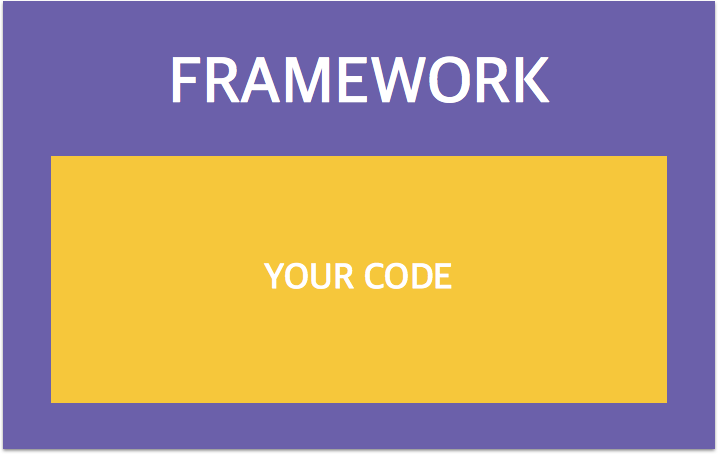
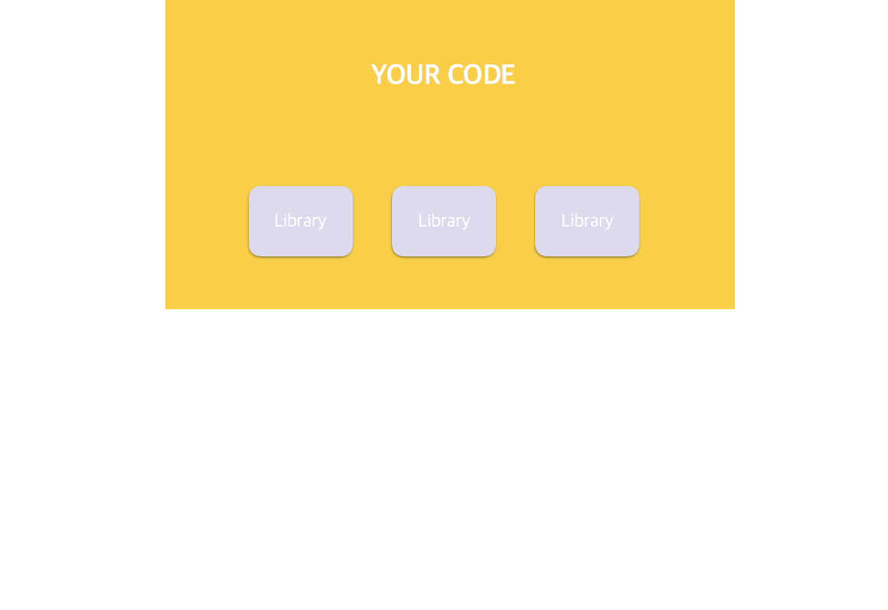

# [NODE] 개발을 빠르고 쉽게 만들어주는 도구들을 알아보자! - 1. 프레임워크, 라이브러리 , 플랫폼에 대해서 

어떤 프로젝트를 만들때, 밑바닥부터 하나하나 만들기에는 오래 걸리고,복잡하며,어렵습니다. 이런 불편한 점을 개선시키기 위해 많은 개발자들은 손쉽고 빠른 프로젝트 개발을 위한 여러가지 도구를 만들어 주었는데요. 이러한 도구에 대해 알아봅시다. 

## 프레임워크 , 라이브러리, 플랫폼

프레임워크, 라이브러리, 플랫폼은 개발 공부를 하면서  많이 듣게 되는 단어 중 하나인데요. 비슷한 것 같은데 설명하기 굉장이 헷갈리는 개념들 중 하나입니다. 차이점이 뭘까요?

### 프레임워크 

프레임워크는 프로젝트의 목적(웹/앱/서버)에 구조를 잡아주는 역할을 합니다. 필수적으로 필요한 구조를 잡아주며, 기본적으로 필요한 라이브러리를 포함하고 있습니다. 기본적인 규칙이 존재하기 때문에, 프레임워크의 틀 속에서 프로젝트의 개발을 해야합니다. 

 
### 라이브러리 

라이브러리는 프로젝트 시 필요한 기능들을 모아둔 도구입니다. 전체적인 프로젝트 구조에서 기능을 제공해 줍니다. 선택적으로 필요한 `부품`입니다. 라이브러리는 필요한 하나의 기능 단위를 말하기 때문에 선택적으로 필요한 부분을 설치해서 사용합니다.

### 프레임워크 vs 라이브러리 
 예를들어볼까요? 
 
  웹사이트 개발시 `Express` 웹프레임워크를 통해 싱글페이지로 이루어진 단순한 웹서비스 뿐만 아니라  쇼핑몰,커뮤니티같은 대형 서비스의 골조를 다지게 됩니다. 
  
  하지만 간단한 사이트와 달리, 대형 사이트들에는 여러 기능이 필요하게 됩니다. 대표적으로 `회원가입`의 기능이 들어가는 사이트들이 많죠. 이런 경우 세션처리 / association / 보안처리 등 복잡한 개발이 필요합니다. 이러한 **복잡한 기능을 재사용** 하기 위해 개발자들은 라이브러리(`부품`)을 찾아 빠르게 개발을 진행할 수 있습니다. 프레임워크는 철근을 다진 건물이라고 생각하면, 라이브러리는 포크레인, 시멘트를 바르는 도구 라고 생각하면 쉬울까요? 

### 플랫폼 

소프트웨어에서의 플랫폼의 정의는 `프로젝트가 실행되는 환경`을 말합니다. Node.js 또한 플랫폼입니다. 

##### Node.js의 실행 환경 

- 네트워크 애플리케이션(특히 서버 사이드) 개발에 사용되는 소프트웨어 플랫폼 
- Javascript 언어 사용
-  Non-blocking I/O와 단일 스레드 
- 내장 HTTP 서버 라이브러리를 포함하고 있어 별도의 소프트웨어 없이 동작하는 것이 가능
- 웹 서버의 동작에 있어 더 많은 통제 가능 

자 이제 기본적인 개념을 알았다면, 다음 페이지에서 Node.js에서 사용되는 프레임워크 / 라이브러리 들을 알아봅시다. :)

#### 참고 자료
- http://blog.gaerae.com/2016/11/what-is-library-and-framework-and-architecture-and-platform.html
- https://ko.wikipedia.org/wiki/Node.js
- https://ko.wikipedia.org/wiki/Node.js