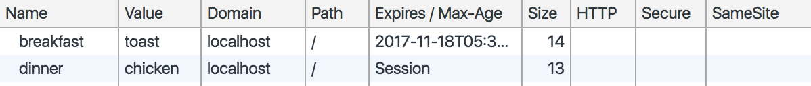

# Chap06 Http Module
Node.js 에서 사용하는 기본적인 웹 모듈로, 웹 서버와 클라이언트 생성에 관한 기능을 담당한다

## HTTP (HyperText Transefer Protocol) 
### BASIC
##### HyperText
참조`Hyper Link`를 통해 독자가 한 문서에서 다른 문서로 즉시 접근할 수 있는 텍스트
##### Protocol
외교 쪽에서 사용되는 용어. 국가간에 약속을 의미한다.
통신에서는 어떤 시스템이 다른 시스템과 통신을 원활하게 해주는 약속으로 정의된다
#### HTTP? 
`TCP/IP(80)` 를 이용하여 컴퓨터와 컴퓨터 사이에 데이터를 주고받는 프로토콜.
 가장 기본적인 `web module`로 사용된다

#### HTTP 특징 
##### 방식
 `웹 브라우저`를  통해 `클라이언트의 요청`으로 `서버`에 접속하여  `클라이언트 요청`에 대한 `응답`을 전송 후 연결을 종료한다
 
##### 장점
 - 연결 상태를 유지하지 않기 때문에 전산 자원이 적게 든다

##### 단점
-  연결이 지속적이지 않기에 추가적인 `클라이언트 요청`시 어떤 클라이언트 이 요청인지 모른다

- 다수의 `클라이언트 요청` 각각의 요청을 구분 할 수 없어 제대로 된 응답인 데이터를 전송 할 수 없다

##### 단점 솔루션 

- Cookie
- Session
- URL Rewriting
- Hidden Form Field
   
##### 참고사항

연결 상태 유지는 프로토콜: `FTP`, `Telnet`


## 1. 요청과 응답 

#### web server 
요청을 받고 그에 대한 응답을 전송하는 역할

`사용자 요청` : url 을 이용해 요청 

`서버 응답` : 해당 url을 받고 그에 대한 응답 제공 

##### 클라이언트 : 요청하는 대상 `url` 로 요청한다
##### 서버 : 응답하는 대상 `html`파일을 제공한다

### web server 만들기


### http method : createServer([requestListener])
web server를 생성해준다 `requestListener`는 
자동으로 Event: 'request'를 연결해준다 
### Event: 'request'
Added in: v0.1.0
- `request` <http.IncomingMessage>
- `response` <http.ServerResponse>


###### sample
###### `option`+`command`+`I` > `Network` 탭에서 요청, 응답 메세지를 확인할 수 있다

Request message
```html
- Request URL : http://127.0.0.1:52273/
- Request Method : GET

- Request Headers
Accept : text/html , application/xhtml#xml,application/xml; q = 0.9,*/*; q = 0.8
...
```
Response message
```html
- Status Code : 200 OK

- Request Header 
Connectioon : Keep -alive

- Response Data
<!DOCTYPE html>
...
```

## 2. server 객체

`http` 에서 요청을 받고 응답을 해주는 객체

###### sample code

```javascript
// http module 추출
const http = require('http');

// web server를 생성
var server = http.createServer();

// web server 실행
server.listen(22222);
```

#### server method

`listen(port[,callback]` : start server
`close([callback])` : close server

###### sample
```javascript
// web server 실행
// server 실행 시, 터미널에서 확인 후 강제종료(command+c)를 누르고 다시키면 안되는 경우가 발생. 이럴때는 터미널을 아예 종료하고 키면 해결된다. 
server.listen(22222,function(){
    console.log('server running at http://127.0.1:22222')
});

//10초 후 함수 실행
var test = function(){
    //close server
    server.close();
};
// 1초 뒤 test 실행 
setTimeout(test,1000);
```
#### server event
- `request` : 클라이언트가 요청 시 발생
- `connection` : 클라이언트 접속 시 발생
- `close` : 서버 종료 시 발생
- `checkContinue` : 클라이언트가 계속 연결 할 때 발생
- `upgrade` : 클라이언트가 HTTP 업그레이드 요청 시 발생
- `clientError` : 클라이언트 오류 시 발생 

###### sample
```javascript
// server 객체의 이벤트 
var http = require('http');
var server = http.createServer();
// 클라이언트가 요청 시 발생
server.on('request',function(code){
    console.log('request On: 클라이언트가 요청 시 발생');
})
// 클라이언트 접속 시 발생
server.on('connection',function(code){
    console.log('Connection On: 클라이언트 접속 시 발생')
})

// 클라이언트 종료 시 발생
server.on('close',function(code){
    console.log('Close On : 클라이언트 종료 시 발생')
})
server.listen(22222);
```
###### result
```
Connection On: 클라이언트 접속 시 발생
request On: 클라이언트가 요청 시 발생
Connection On: 클라이언트 접속 시 발생
request On: 클라이언트가 요청 시 발생
Connection On: 클라이언트 접속 시 발생
request On: 클라이언트가 요청 시 발생
Connection On: 클라이언트 접속 시 발생
request On: 클라이언트가 요청 시 발생
```

## 3. response 객체

`server` 객체에서 `http` 통신을하면 *response*,*request* 객체를 반환한다. 이 중 **request** 는 `client`에게 응답 메세지를 보내기 위해 사용한다 

#### response method

#### `writeHead`(statusCode[,statusMessage][,headers])
응답 헤더를 작성한다.
#### `end`([data][,encoding][,callback])
응답 본문을 작성한다

###### sample

```javascript
require('http').createServer(function(req,res){
    res.writeHead(200,{'Content-Type': 'text/html'});
    res.end('<h1>hello node! </h1>')
}).listen(22222,function(){
    console.log('server start!');
})
```

### 3.1 File System module 을 사용한 html 페이지 제공

File System module 을 사용해 html 파일과 javascript 파일을 분리할 수 있다.

#### fs.readFile(path[, options], callback)
파일을 읽어오는 fs 메서드. 'Content-Type'에 불러올 수 있는 값을 지정한다.

###### sample
##### filesystem.http.js
```javascript
// module 추출 
var http = require('http');
var fs = require('fs');

http.createServer(function(req,res){
    // html 파일을 불러옴 
    // fs.readFile('path|number|buffer|url|options',callback(err,data)')
    fs.readFile('htmlPage.html',function(err,data){
        res.writeHead(200,{'Content-Type':'text/html'});
        res.end(data);
    })
}).listen(22222,function(){
    console.log("server start!");
});
```
##### htmlPage.html
```html
<!DOCTYPE html>
<html lang="en">
<head>
    <title>Document</title>
</head>
<body>
    <h1>hello nodejs</h1>
    <h2>author.rintIanTta</h2>
    <hr>
    <div class="1000">Lorem ipsum.</div>
</body>
</html>
```

### 3.2 이미지와 음악파일 제공

###### sample
```javascript
// read jpeg file
http.createServer(function(req,res){
    fs.readFile('pooh.png',function(err,data){
        res.writeHead(200,{'Content-Type': 'image/jpeg'});
        res.end(data);
    })
}).listen(22223,function(){
    console.log("hello world");
})
// read audio file
http.createServer(function(req,res){
    fs.readFile('hi.mp3',function(err,data){
        res.writeHead(200,{'Content-Type': 'audio/mp3'});
        res.end(data);
    })
}).listen(22224,function(){
    console.log("22224 start")
})
```

##### 'Content-Type' 종류 
- `text/plain` 
- `text/html` 
- `text/css `
- `text/xml `
- `image-jpeg`
- `image-png`
- `video/mpeg`
- `audio/mp3`

content-type 이라고 명시하면 에러난다. 소문자 에러 주의 해야함

### 3.3 쿠키 생성하기

HTTP 쿠키는 `서버`가 `브라우저(chrome)`에 사용자의 데이터를 일정한 시간동안 저장해 놓아, 요청이 일어날 경우 브라우저에 있는 데이터를 활용한다. 

- 보통 로그인 기능에 사용한다
- 서버,클라이언트 둘 다 저장하고 사용할 수 있다
 


#### 사용 방법
쿠키에서 저장하는 목록은 여러개지만, 대표적으로 Name=Value 값을 받는다. 이에 다른 타입을 추가하고싶다면 세미콜론을 붙히고 설정을 해주면 된다.
```html
'Set-Cookie': ['Name = value']
```

#### 쿠키 생성하기 

###### sample
```javascript
var http = require('http');

http.createServer(function(req,res){

    res.writeHead(200,{
        'Content-Type' :'text/html',
        // 쿠키 생성
        'Set-Cookie':['breakfast = toast', 'dinner = chicken']

        //Expires 내용 추가 시 
        //'breakfast = toast;Expires ='+date.toUTCString()
    });

    res.end('<h1>'+req.headers.console+'</h1>');
    
}).listen(22222,function(){
    console.log("Server Running start 22222 ")
})
```

###### result 1
처음 요청 시 쿠키를 갖지 않고 있어 `undefined` 출력 
```javascript
undefined
```
###### result 2
새로고침시에는, 쿠키가 생성되어 있으므로 데이터 출력
```javascirpt
breakfast=toast; dinner=chicken
```

#### 쿠키 확인하기

##### `개발자도구 > Application > cookie`

##### 사진 
