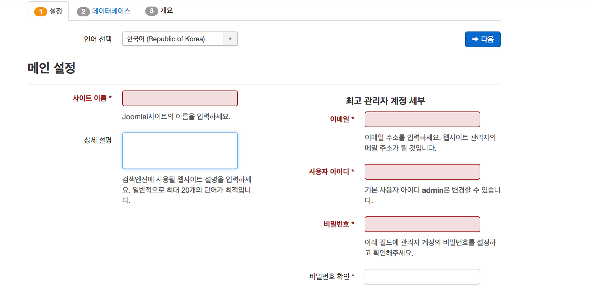
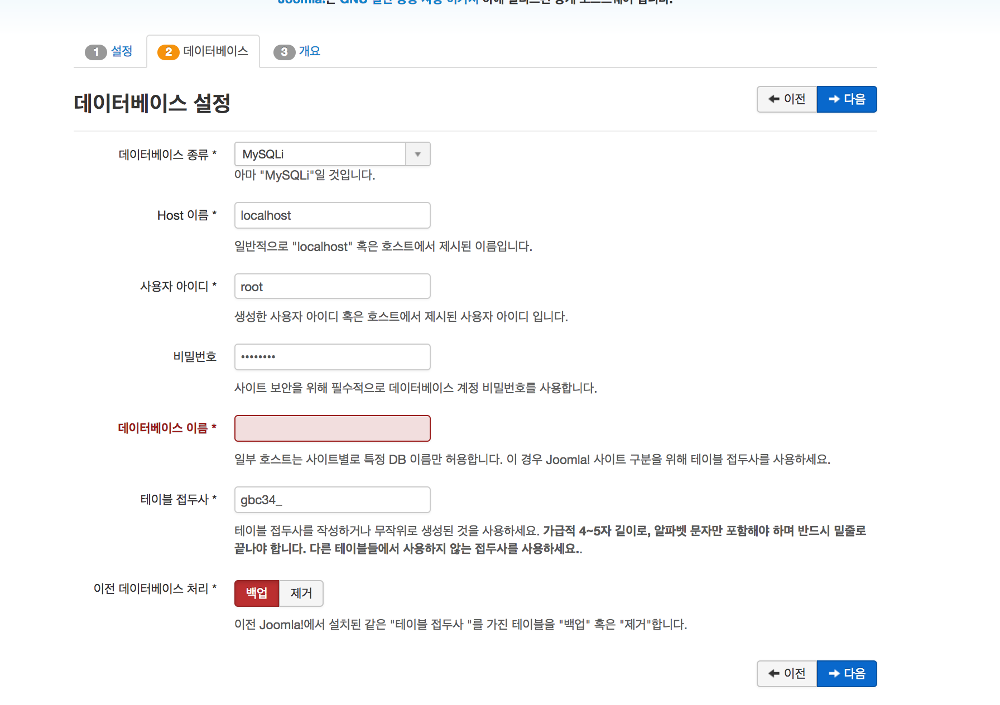
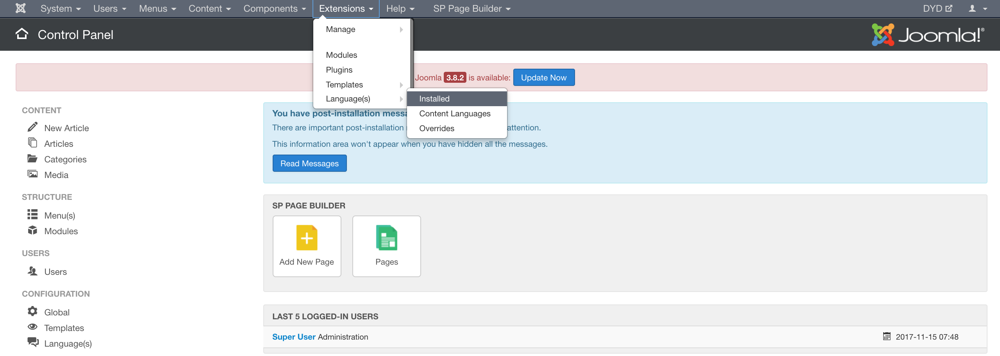
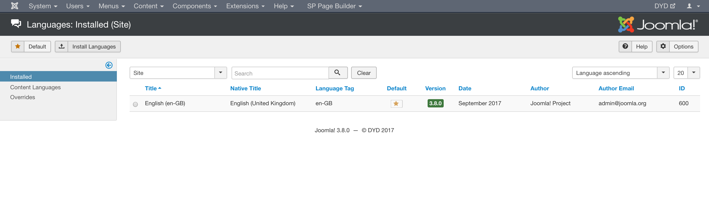
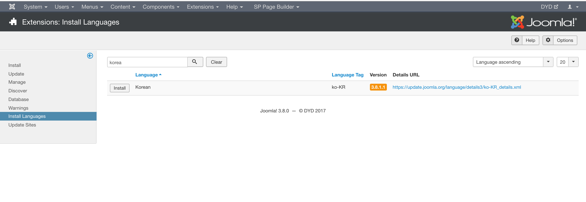
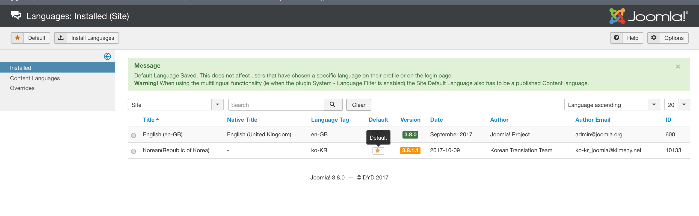
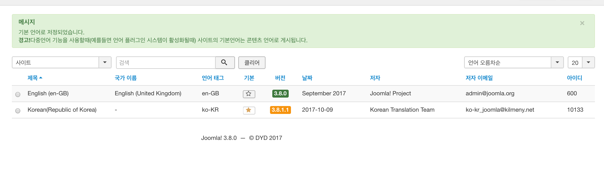
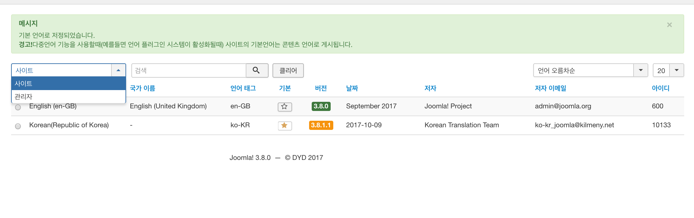
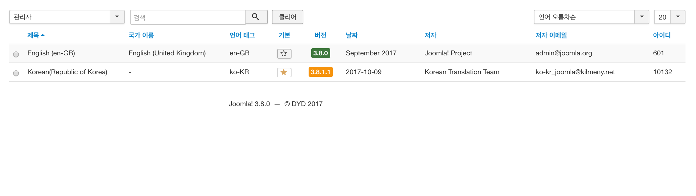

# Joomla 설치

## 설치 전 Basic

### 준비사항 

#### php 환경 install

자세한 설치 가이드는 생활 코딩을 참조했습니다
- https://opentutorials.org/course/3018/5104
##### mamp 
- https://bitnami.com/stack/mamp
##### joomla 
- https://bitnami.com/stacks
##### Template 
- `php/joomla`를 사용한 템플릿 구매해놓은 상태로 시작합니다.

## 설치완료 후 템플릿 실행

기본 환경을 설정하고 템플릿을 실행하면 줌라를 설치하는 페이지가 나옵니다

1. 설정
2. 데이터메이스
3. 개요

부분의 탭으로 이루어져있네요

### 1. 설정 

여기서 입력하는 사용자아이디,비밀번호가 joomla 관리자 계정이 됩니다.

### 2. 데이터베이스

`MYSQLi`가 뭔지 모르겠지만 `mysql(pdo)`?를 하자니 `installation` 에서 이상한걸 지우라고 얘기하는데 그런 파일도 없고ㅠㅠㅠ 뭐지 싶다가 `MYSQLi`로 설정하니 잘 작동되었어요. 컴퓨터의 mysql `id`와 `비밀번호`를 입력하면 됩니다.

## 3. 개요

확인사항을 참고하고 완료하면 됩니다

### 4. 대쉬보드 로그인

`Joomla` 를 설치한 페이지 뒤에 
`/administrator`를 붙혀주면 대시보드 페이지에 들어갈 수 있습니다

###### examile
##### Joomla 설치 페이지

 - `http://localhost:8080/Quickstart
 
###### Joomla dashboard 
- http://localhost:8080/Quickstart/**administrator**

### 5. 한글팩 설치 

#### Extension.Language>installed 

한글팩을 설치하기 위해 경로를 이동해 줍니다

#### search > korean 검색

installed 에 아직 영어만 되어있네요 한글로 바꿔봅시다.
`search` 창에 `korean` 을 검색해줍니다.

#### korean install

한국어가 있네요 `intall` 버튼을 눌러줍니다.

#### default 변경 

설치가 된 화면을 보면 English 외에 설치한  Korean이 존재합니다. 이 Korean에 default 를 선택하면 사이트에 한국어가 설정됩니다!

#### 관리자 한국어 설정 

현재는 사이트만 값이 바껴있는데요 관리자도 바꿔주면 편해지겠죠? 

탭을클릭하고 관리자 탭을 들어가서

똑같이 Default 버튼을 Korean으로 바꿔주면 한국어로 설정됩니다.:)