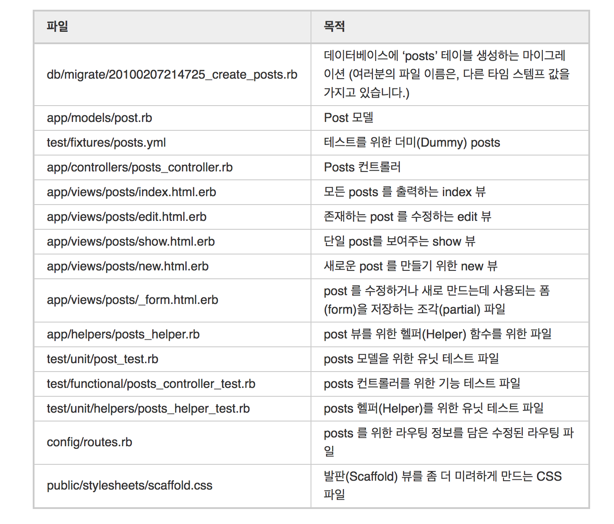
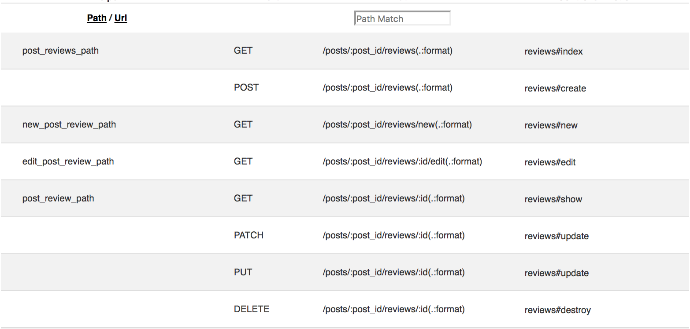
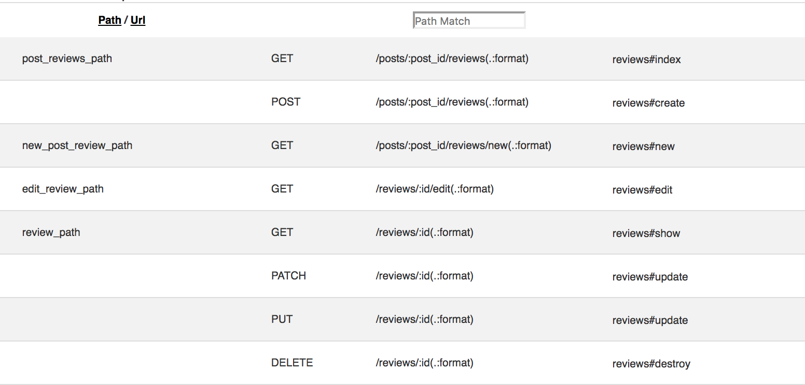

# Scaffold 

rails 에서 골조를 만들어주는 기능. 스캐폴딩 명령어 하나로 `model`, `view`, `controller`, `resources` 등의 골조를 한번에 설정해준다. 

### 명령어
##### terminal
```
$ rails generate scaffold MODEL_NAME COLUMN_NAME:TYPE 
```
##### sample
``` 
$ rails generate scaffold Post name:string title:string content:text
```
**result**
```ruby
  invoke  active_record
      create    db/migrate/20171119064052_create_posts.rb
      create    app/models/post.rb
      invoke    test_unit
      create      test/models/post_test.rb
      create      test/fixtures/posts.yml
      invoke  resource_route
       route    resources :posts....etc
```
만들어 주는 파일은 다음과 같다
**(rails guide  표 참고)**


#### resource 살펴보기
`routes.rb` 를 살펴보면 간단한 한줄로 지정되어있다
```ruby
resources :stores
```
간단히 지정되었지만 사실 7가지 기능을 한번에 묶어 연결해놓은것이다

##### - 1. posts#index 

게시글 목록을 보여준다
```ruby
get '/posts' => 'posts#index'
```
##### - 2. posts#new
글쓰기 폼을 보여준다
```ruby
get '/posts/new' => 'posts#delete'
```
##### - 3. posts#create
글 등록을 해준다
```ruby
post '/posts' => 'post#create'
```
##### - 4. posts#show
:id 에 해당하는 글 번호의 글을 보여준다
```ruby
get '/posts/:id' => 'post#show'
```
##### - 5. posts#edit
:id 에 해당하는 글 번호의 수정 하는 폼을 보여준다
```ruby
get '/post/:id/edit' => 'posts#edit'
```
##### - 6. posts#update
:id 에 해당하는 글 번호를 수정한다
```ruby
get 'posts/:id' => 'posts#update'
```
##### - 7. posts#destory
해당 글을 삭제한다
```ruby
delete 'posts/:id' => 'posts#destroy'
```

7가지를 단순에 한줄로 만들어준다! 

만약 스캐폴딩 기능에서 제공해주는 기능이 다필요없을경우 (`글쓰기만필요해` ! `수정 삭제 필요없어`!  )

#### resource except
```ruby
 resources :posts, except: [:update, :edit :destroy]
 ```
 뒤에 `except` 옵션을 걸어 제외해주거나,
 ```ruby
 resources :posts, only: [:index,:new,:create,:show]
 ```
 `only` 옵션을 걸어주어 원하는 기능만 조정할 수 있다

## Scaffolding 중첩 사용해보기

스캐폴딩을 중첩을 사용할 경우가 있다. 예를들어 `post` 라는 게시글에 `review` 기능을 만들고 싶다면, 1개의 `post` 여러개의 `review`가 들어가기 때문에, Association 설정과 resource 중첩을 해줘야한다.

### 1. 종속되는 review scaffold 생성 
scaffold 생성시 `post:references`를 적용해주면 
##### terminal
```
$ rails g scaffold review post:references content:text
```
### 2. Model 설정 

##### Model/reviews.rb
자동으로 belongs_to 를 생성해준다. `Post.rb`에 `has_many :reviews`를 지정하자. 
```ruby
class Review < ApplicationRecord
  belongs_to :post
end
```
##### Model/post.rb
```ruby
class post < ApplicationRecord
    has_many :reviews
end
```
### 3. Route 설정 
종속되는 route를 설정해준다
###### example
```ruby
  resources :post do
    resources :reviews
  end
```
##### rails/info
결과를 보면 이런식으로 나온다! 하지만 url이 너무 드러운것.. 이게 마음에 안들때는 `shallow:true` 설정을 해줄 수 있다


### 3.1 shallow 설정 후
`new`,`create`,`index를` 제외한 부분의 url이 깔끔해진 것을 볼 수 있다. 
###### example
```ruby
  resources :posts ,shallow: true do
    resources :reviews
  end
```


다만 이 `shallow: true` 설정시에는, URL 변경으로 인해 View 부분의 수정이 필요하다 
#### post/show.html.erb
리뷰 쓰기 버튼을 추가
```html
<h1>리뷰 추가</h1>
<%= link_to 'review 쓰기',new_post_review_path(params[:id]) %>  
```
#### review/_form.html.erb
```html
<!-- ##before -->
<%# form_with(model: review, local: true) do |form| %>

<div class="field">
  <%= form.label :post %>
  <%= form.text_field :post, id::review_post %>
</div>

<!-- ## after -->
<%= form_for(@review, url: post_reviews_path) do |form| %>

<div class="field">
    <%= form.label :post_id %>
    <%= form.text_field :post_id, id: :review_post %>
</div>

```
##### reviews/new.erb

```html
<!-- ## before -->
<%= link_to 'Back', reviews_path %>
<!-- ## after  -->
<%= link_to 'Back', post_reviews_path %>
```

#### 참고자료
- https://rubykr.github.io/rails_guides/getting_started.html#Getting-Up-and-Running-Quickly-with-Scaffolding

- https://dayone.me/1ajvzWC

- https://github.com/likesoomti/overlap_scaffold-1