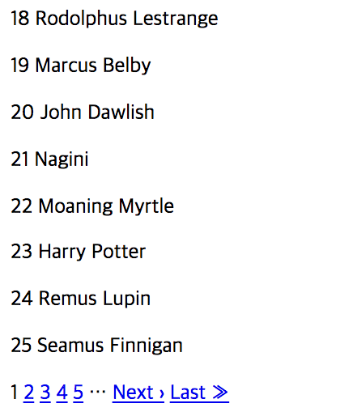

#  kaminari

kaminari를 간단히 설명하면, 페이지 네비게이션을 쉽게 만들게 해주는 gem 라이브러리 입니다.

## 설치 

### Install 
##### terminal
```
$ gem 'kaminari'
```
terminal
```
$ bundle install
```

 페이지 네비게이션 example을 활용하기 위해서 간단한 `Post model`을 만들어 보겠습니다.  

### Model 생성하기
##### terminal
 ```
 // 모델 생성 
 $ rails g model post title:string content:text
 ```
##### terminal
 ```
 // 모델 저장
 $ rails db:migrate
 ```

### seed 생성하기
seed 는 더미 데이터를 넣어 테스트를 하거나, 기존 데이터를 넣을 때 사용합니다. `Faker gem`을 통해 더미값을 넣어주었습니다.
##### kaminari-test/db/seeds.rb
 ```ruby
500.times{
    post = Post.new(
        title: Faker::HarryPotter.character,
        content: Faker::HarryPotter.quote
      )    
    post.save
}
```
##### seed 저장하기
```
$ rails db:seed
```

### controller 설정
##### terminal
```
$ rails g controller posts index
```
##### app/controllers/posts_controller.rb
컨트롤러에 존재하는 `params[:page]`는 kaminari 설치시 기본 설정으로 가져옵니다. 이 기본 설정은 원하는 값을 넣어 바꿀 수 있습니다.
```ruby
class PostsController < ApplicationController
  def index
    @posts = Post.page(params[:page])
  end
end
```

### View 설정 
##### app/views/posts/index.html.erb
```html
<% @posts.each do |post| %>
<p><%=post.id %> <%=post.title%></p>
<% end %>
<%= paginate @posts %>
```
기본 설정이 완료되었습니다. 이걸 가지고 쿼리를 실행해 보겠습니다
### Query
page()는 페이지를 어디 펼칠지를 나타내 줍니다. params[:page]는 처음에는 1페이지를 `default`로 설정해줍니다.

##### 1. **page()**
```
$ Post.page(params[:page])
```


##### 2. **page method**
```ruby 
    Post.count                     # 총 post의 갯수               
     Post.page(1).limit_value      # 한 페이지에 나오는 post 갯수
     Post.page(1).total_pages      # 전체 page navigation 값  
     Post.page(1).current_page     # 현재 페이지   
     Post.page(1).next_page        # 다음 페이지    
     Post.page(2).prev_page        # 이전 페이지
     Post.page(2).first_page?      # 2페이지가 처음인지? (false)
     Post.page(50).last_page?      # 50 페이지가 마지막 페이지가 맞는지 (true)
     Post.page(100).out_of_range?  # 100 페이지가 지금 존재하는지 (false)
```
##### 3. **per()**
페이지가 default 로 25개씩 나오게 되어있지만, 값을 변경하고 싶을 경우 per()을 사용합니다.
```ruby
# 10 개의 값을 나열 
User.page(params[:pages]).per(10)
```
##### 4. **padding()**
padding 값 만큼 건너 뛰고 나오는 메소드인 것 같습니다. 
```ruby
User.page(params[:pages]).per(10).padding(30)
# => 31 부터 나온다
```

### Configuring Kaminari
**Kaminari** 에서 제공해주는 default value를 조정하고 싶다면,`Kaminari.configure`를 만들어서 override를 해줄 수 있습니다.
```
default_per_page      # 25 by default
max_per_page          # nil by default
max_pages             # nil by default
window                # 4 by default
outer_window          # 0 by default
left                  # 0 by default
right                 # 0 by default
page_method_name      # :page by default
param_name            # :page by default
params_on_first_page  # false by default
```


## 참고사이트 
https://github.com/kaminari/kaminari